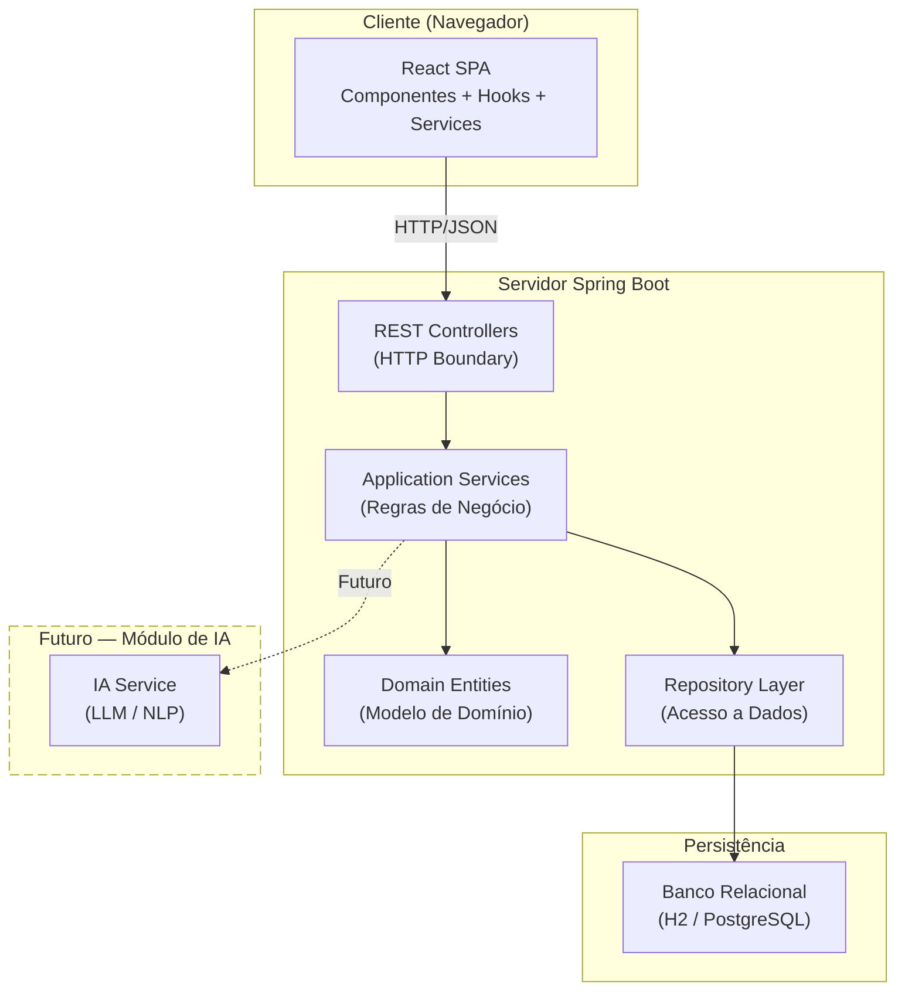
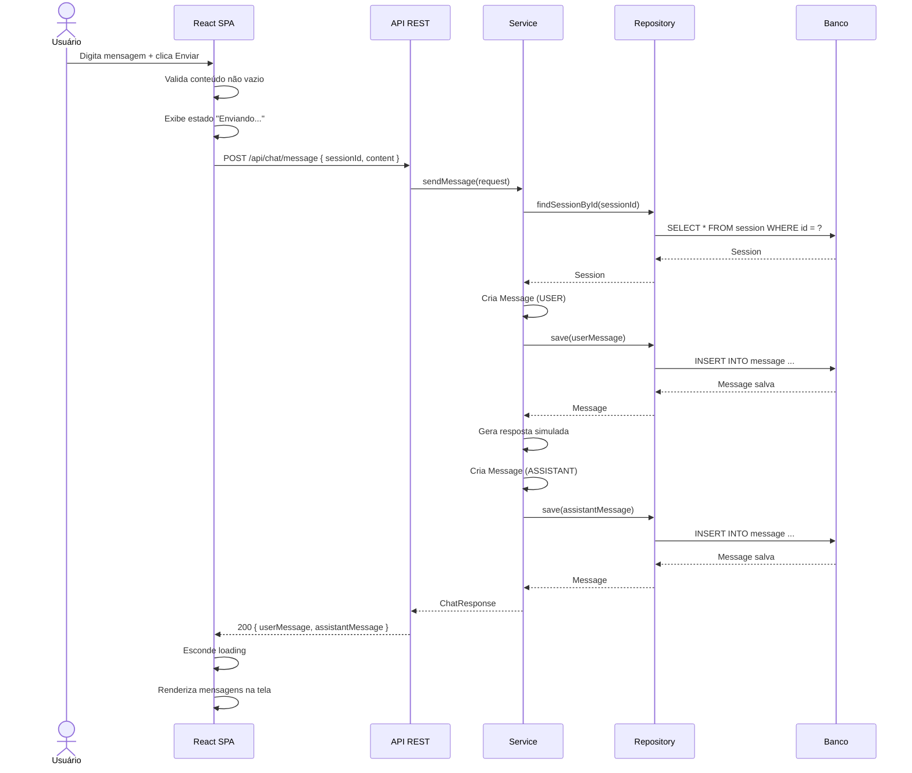
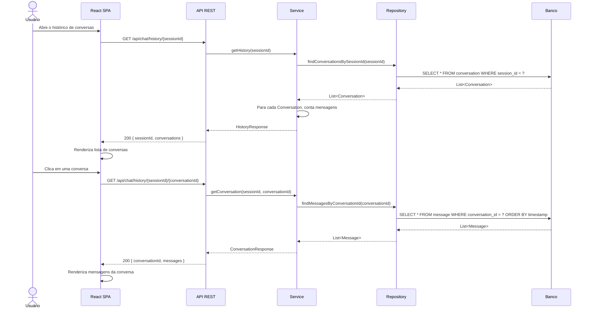
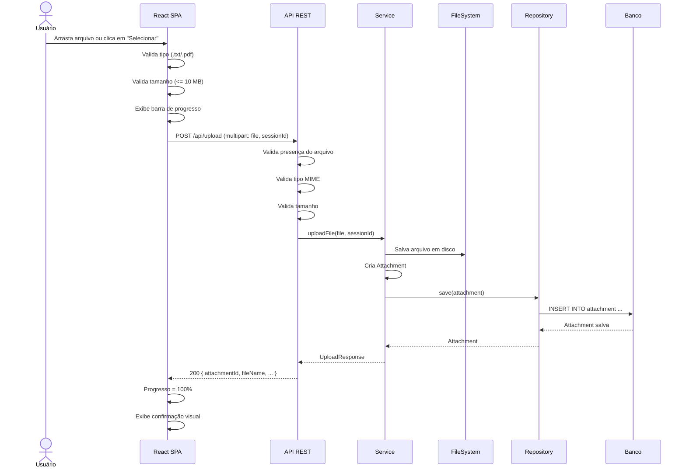
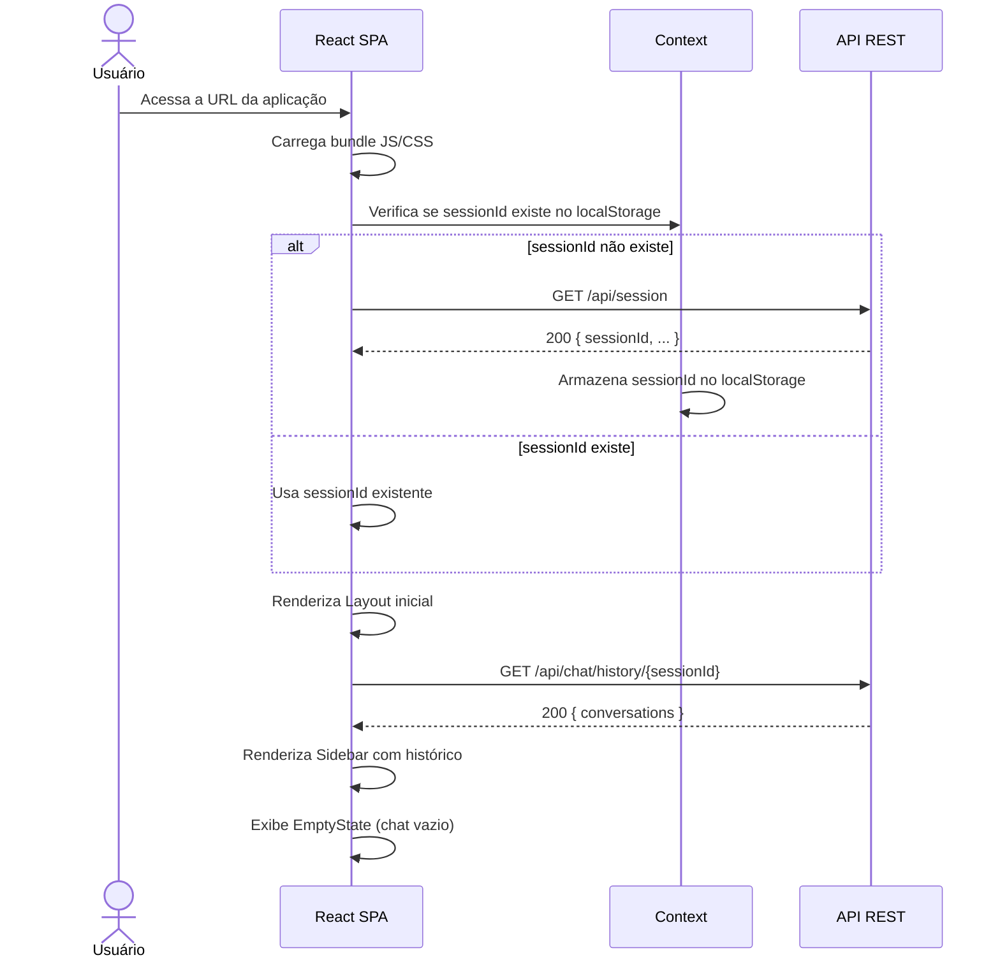
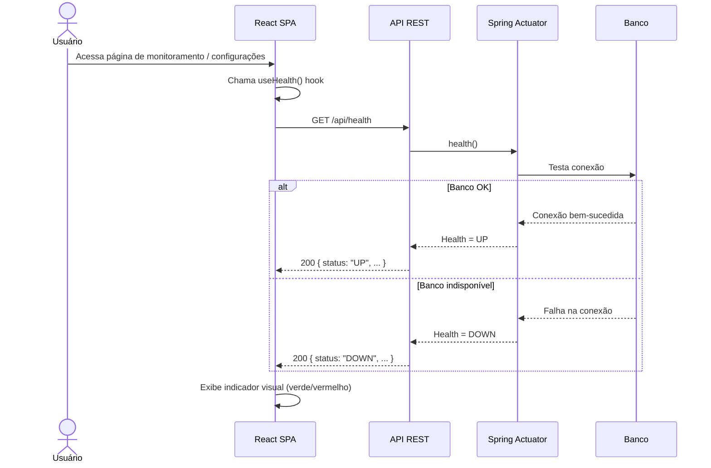
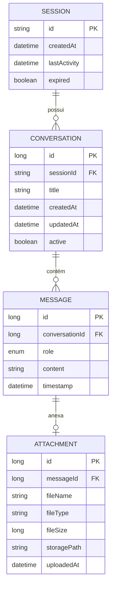

# System Docs

> **Contrato oficial do sistema — Chat Inteligente com Suporte a Documentos**  
> Versão: 1.0.0  
> Status: `rascunho aprovado`  
> Propósito: Documentação arquitetural para orientar equipe de desenvolvimento e ferramentas de geração automática de código por IA.

---

## Sumário

1. [Visão Geral do Sistema](#1-visão-geral-do-sistema)
2. [Arquitetura Geral](#2-arquitetura-geral)
3. [Arquitetura Back-end](#3-arquitetura-back-end)
4. [Domínio da Aplicação](#4-domínio-da-aplicação)
5. [API REST](#5-api-rest)
6. [Contratos JSON](#6-contratos-json)
7. [Fluxos da Aplicação](#7-fluxos-da-aplicação)
8. [Persistência](#8-persistência)
9. [Arquitetura Front-end](#9-arquitetura-front-end)
10. [Estrutura de Componentes](#10-estrutura-de-componentes)
11. [Hooks Customizados](#11-hooks-customizados)
12. [Comunicação Front x Back](#12-comunicação-front-x-back)
13. [UX e Acessibilidade](#13-ux-e-acessibilidade)
14. [Validações](#14-validações)
15. [Códigos HTTP](#15-códigos-http)
16. [Requisitos Não Funcionais](#16-requisitos-não-funcionais)
17. [Estrutura de Diretórios](#17-estrutura-de-diretórios)
18. [README](#18-readme)
19. [AGENTS.md](#19-agentsmd)
20. [Considerações Arquiteturais](#20-considerações-arquiteturais)

---

# 1. Visão Geral do Sistema

## 1.1 Objetivo

Sistema web para chat interativo com suporte a upload de documentos (`.txt` e `.pdf`). O usuário envia mensagens ou documentos e recebe respostas simuladas, com histórico completo de conversas persistido. A arquitetura é projetada para futura integração com Inteligência Artificial para análise de conversas e documentos.

## 1.2 Escopo

| Inclui | Não inclui (futuro) |
|--------|---------------------|
| Envio de mensagens de texto | Integração com LLM / IA |
| Respostas simuladas do chat | Análise semântica de documentos |
| Histórico completo de conversas | Processamento de linguagem natural |
| Upload de arquivos `.txt` e `.pdf` | Transcrição de áudio/vídeo |
| Monitoramento de saúde da API | Autenticação e autorização |
| Persistência relacional | WebSocket para streaming de resposta |
| Interface SPA responsiva | Chat em tempo real |

## 1.3 Limitações

- Apenas arquivos `.txt` e `.pdf` são aceitos.
- Tamanho máximo de arquivo: **10 MB**.
- Respostas do chat são **simuladas** — não há integração com IA nesta versão.
- Não há suporte a autenticação de usuários.
- O histórico é segregado por `sessionId`, sem vínculo com identidade de usuário.
- Uma sessão expira após **24 horas** sem atividade.

## 1.4 Tecnologias

| Camada | Tecnologia | Versão (referência) |
|--------|-----------|---------------------|
| Front-end | React | 18.x |
| Linguagem Front | TypeScript | 5.x |
| Bundler | Vite | 5.x |
| Estilização | CSS Modules | — |
| Back-end | Java | 17+ |
| Framework Back | Spring Boot | 3.x |
| ORM | Spring Data JPA / Hibernate | 6.x |
| Banco | H2 (dev) / PostgreSQL (prod) | — |
| Testes Back | JUnit 5 + Mockito | — |
| Testes Front | Vitest + Testing Library | — |
| Documentação | Markdown + Mermaid | — |

## 1.5 Arquitetura Geral



## 1.6 Preparação Futura para IA

A camada `Service` foi projetada com interfaces que permitem a substituição do atual `SimulatedChatService` por um `AIChatService` real sem alterar Controllers, Repositories ou o front-end. O ponto de extensão é a interface `ChatService`, que abstrai a lógica de gerar respostas.

---

# 2. Arquitetura Geral

## 2.1 Visão em Camadas

```
┌─────────────────────────────────────────────┐
│              REACT SPA (Front-end)           │
│  Componentes → Hooks → Services → Contextos │
├─────────────────────────────────────────────┤
│                API REST (HTTP/JSON)          │
├─────────────────────────────────────────────┤
│              SPRING BOOT (Back-end)          │
│  Controllers → Services → Repositories → BD │
├─────────────────────────────────────────────┤
│          BANCO RELACIONAL (H2/PostgreSQL)    │
├─────────────────────────────────────────────┤
│          ◈ FUTURO: MÓDULO DE IA ◈           │
└─────────────────────────────────────────────┘
```

## 2.2 Responsabilidade de Cada Camada

### React SPA
- Renderização da interface do usuário.
- Gerenciamento de estado local e global (Context API).
- Chamadas HTTP para a API REST via serviços dedicados.
- Tratamento de loading, erro e estados vazios.
- Validação do lado do cliente antes do envio.

### API REST
- Contrato público entre front-end e back-end.
- Formato de troca: JSON.
- Endpoints versionados sob o prefixo `/api/`.
- Códigos HTTP padronizados para sucesso e erro.

### Spring Boot
- **Controllers**: Apenas orquestração HTTP — delegam para Services.
- **Services**: Toda regra de negócio da aplicação.
- **Repositories**: Acesso a dados via Spring Data JPA.
- **Entities**: Modelo de domínio anêmico com anotações JPA.
- **DTOs**: Objetos de transferência que isolam a representação externa do modelo interno.

### Banco Relacional
- Persistência de conversas, mensagens, anexos e sessões.
- H2 em ambiente de desenvolvimento, PostgreSQL em produção.

### Futura IA
- Camada adicional que consumirá o histórico de conversas e documentos anexados.
- Integração através de porta/adaptador na camada de Service.

---

# 3. Arquitetura Back-end

## 3.1 Clean Architecture

O back-end segue os princípios da **Clean Architecture** (Robert C. Martin), organizado em camadas concêntricas onde as dependências apontam para dentro — ou seja, camadas externas dependem de camadas internas, nunca o contrário.

```
┌──────────────────────────────────────────────────┐
│                     Controllers                    │
│   (HTTP boundary — entrada/saída da aplicação)    │
├──────────────────────────────────────────────────┤
│                     Services                       │
│     (Casos de uso — regras de negócio puras)      │
├──────────────────────────────────────────────────┤
│                  Domain / Entities                 │
│        (Modelo de domínio + Value Objects)         │
├──────────────────────────────────────────────────┤
│                   Repositories                     │
│          (Acesso a dados — persistência)           │
├──────────────────────────────────────────────────┤
│   DTOs  │ Config │ Exceptions │ Mapper │ Util     │
└──────────────────────────────────────────────────┘
```

## 3.2 Responsabilidade de Cada Camada

### Controllers
- Receber requisições HTTP.
- Validar entrada (formato, presença de parâmetros).
- Invocar o Service apropriado.
- Retornar resposta HTTP com DTO e status code adequado.
- **Não contêm regra de negócio.**

### Services
- Implementar todos os casos de uso da aplicação.
- Orquestrar entidades e repositórios.
- Aplicar regras de validação de negócio.
- Transformar entidades em DTOs e vice-versa (via Mapper).
- São independentes de HTTP — poderiam ser chamados por um worker, fila ou CLI.

### Repositories
- Interface com o banco de dados via Spring Data JPA.
- Métodos de CRUD e consultas customizadas.
- **Não contêm regra de negócio.**
- Retornam Entities para os Services.

### Entities
- Representação do modelo de domínio com anotações JPA.
- Relacionamentos, constraints e cascade definidos na entidade.
- Estado puro — sem lógica de negócio complexa.

### DTOs
- Isolam a representação dos dados expostos na API do modelo interno.
- `Request DTO`: dados recebidos do cliente.
- `Response DTO`: dados devolvidos ao cliente.
- `Error DTO`: estrutura padronizada de erro.

### Exceptions
- Hierarquia de exceções de negócio.
- `ResourceNotFoundException`, `ValidationException`, `FileTooLargeException`, `UnsupportedFileTypeException`, etc.
- `GlobalExceptionHandler` (`@RestControllerAdvice`) mapeia exceções para respostas HTTP apropriadas.

### Configurations
- Beans do Spring (CORS, ObjectMapper, Gson, etc.).
- Propriedades da aplicação (tamanho máximo de upload, tipos permitidos, etc.).

### Utilities
- Funções auxiliares: extração de texto de PDF, formatação de data, etc.

## 3.3 Regras Fundamentais

> **Regra 1:** Controllers nunca contêm regra de negócio.  
> **Regra 2:** Services nunca acessam diretamente objetos HTTP (`HttpServletRequest`, `HttpServletResponse`).  
> **Regra 3:** Repositories nunca contêm lógica condicional de negócio.  
> **Regra 4:** Entities nunca expõem setters públicos desnecessários.  
> **Regra 5:** DTOs nunca são usados fora das camadas Controller e Service.

---

# 4. Domínio da Aplicação

## 4.1 Entidades

### Conversation

| Atributo | Tipo | Descrição |
|----------|------|-----------|
| `id` | `Long` | Identificador único |
| `sessionId` | `String` | Identificador da sessão |
| `title` | `String` | Título gerado automaticamente |
| `createdAt` | `LocalDateTime` | Data de criação |
| `updatedAt` | `LocalDateTime` | Data da última atividade |
| `active` | `boolean` | Se a conversa ainda está ativa |

**Relacionamentos:**
- `1:N` com `Message` — uma conversa contém muitas mensagens.

**Responsabilidade:** Agregar mensagens trocadas em uma sessão de chat.

---

### Message

| Atributo | Tipo | Descrição |
|----------|------|-----------|
| `id` | `Long` | Identificador único |
| `conversation` | `Conversation` | Conversa pai |
| `role` | `enum` | `USER` ou `ASSISTANT` |
| `content` | `String` | Texto da mensagem |
| `timestamp` | `LocalDateTime` | Momento do envio |
| `attachment` | `Attachment` | Anexo opcional |

**Relacionamentos:**
- `N:1` com `Conversation`.
- `1:1` com `Attachment` (opcional).

**Responsabilidade:** Representar uma troca individual no chat.

---

### Attachment

| Atributo | Tipo | Descrição |
|----------|------|-----------|
| `id` | `Long` | Identificador único |
| `message` | `Message` | Mensagem associada |
| `fileName` | `String` | Nome original do arquivo |
| `fileType` | `String` | Tipo MIME |
| `fileSize` | `Long` | Tamanho em bytes |
| `storagePath` | `String` | Caminho no sistema de arquivos |
| `uploadedAt` | `LocalDateTime` | Data do upload |

**Relacionamentos:**
- `1:1` com `Message`.

**Responsabilidade:** Armazenar metadados do arquivo enviado.

---

### Session

| Atributo | Tipo | Descrição |
|----------|------|-----------|
| `id` | `Long` | Identificador único |
| `sessionId` | `String` | UUID da sessão |
| `createdAt` | `LocalDateTime` | Data de criação |
| `lastActivity` | `LocalDateTime` | Última interação |
| `expired` | `boolean` | Se a sessão expirou |

**Relacionamentos:**
- `1:N` com `Conversation`.

**Responsabilidade:** Gerenciar o ciclo de vida de uma sessão de usuário.

---

### HealthStatus

| Atributo | Tipo | Descrição |
|----------|------|-----------|
| `status` | `String` | `UP` ou `DOWN` |
| `database` | `String` | Status da conexão com o banco |
| `diskSpace` | `String` | Espaço disponível em disco |
| `timestamp` | `LocalDateTime` | Momento da verificação |
| `version` | `String` | Versão da aplicação |

**Responsabilidade:** Representar o estado de saúde do sistema.

> **Nota:** `HealthStatus` é um objeto de resposta, não uma entidade persistida. Pode ser modelado como um DTO ou Value Object.

---

# 5. API REST

## 5.1 Endpoints

### `GET /api/health`

| Campo | Valor |
|-------|-------|
| Método | `GET` |
| URL | `/api/health` |
| Descrição | Verifica a saúde da aplicação e conexões |
| Payload Entrada | — |
| Payload Saída | `HealthResponse` |
| Status Sucesso | `200 OK` |
| Erros possíveis | `500 Internal Server Error` (se o banco estiver inacessível) |

---

### `POST /api/chat/message`

| Campo | Valor |
|-------|-------|
| Método | `POST` |
| URL | `/api/chat/message` |
| Descrição | Envia uma mensagem e recebe resposta simulada |
| Payload Entrada | `ChatRequest` |
| Payload Saída | `ChatResponse` |
| Status Sucesso | `200 OK` |
| Erros possíveis | `400 Bad Request`, `404 Not Found` (sessão inválida), `422 Unprocessable Entity` |

---

### `GET /api/chat/history/{sessionId}`

| Campo | Valor |
|-------|-------|
| Método | `GET` |
| URL | `/api/chat/history/{sessionId}` |
| Descrição | Recupera o histórico de conversas de uma sessão |
| Payload Entrada | — |
| Payload Saída | `HistoryResponse` |
| Status Sucesso | `200 OK` |
| Erros possíveis | `404 Not Found` (sessão inválida) |

---

### `GET /api/chat/history/{sessionId}/{conversationId}`

| Campo | Valor |
|-------|-------|
| Método | `GET` |
| URL | `/api/chat/history/{sessionId}/{conversationId}` |
| Descrição | Recupera uma conversa específica |
| Payload Entrada | — |
| Payload Saída | `ConversationResponse` |
| Status Sucesso | `200 OK` |
| Erros possíveis | `404 Not Found` |

---

### `POST /api/upload`

| Campo | Valor |
|-------|-------|
| Método | `POST` |
| URL | `/api/upload` |
| Descrição | Faz upload de um arquivo `.txt` ou `.pdf` |
| Payload Entrada | `multipart/form-data` — campo `file` |
| Payload Saída | `UploadResponse` |
| Status Sucesso | `200 OK` |
| Erros possíveis | `400 Bad Request`, `413 Payload Too Large`, `415 Unsupported Media Type` |

---

### `GET /api/session`

| Campo | Valor |
|-------|-------|
| Método | `GET` |
| URL | `/api/session` |
| Descrição | Cria ou recupera uma sessão |
| Payload Entrada | — |
| Payload Saída | `SessionResponse` |
| Status Sucesso | `200 OK` |
| Erros possíveis | — |

---

### `DELETE /api/session/{sessionId}`

| Campo | Valor |
|-------|-------|
| Método | `DELETE` |
| URL | `/api/session/{sessionId}` |
| Descrição | Encerra uma sessão |
| Payload Entrada | — |
| Payload Saída | — |
| Status Sucesso | `204 No Content` |
| Erros possíveis | `404 Not Found` |

---

## 5.2 Tabela Resumo

| Método | URL | Descrição | Status |
|--------|-----|-----------|--------|
| `GET` | `/api/health` | Health check | 200, 500 |
| `GET` | `/api/session` | Criar/obter sessão | 200 |
| `DELETE` | `/api/session/{sessionId}` | Encerrar sessão | 204, 404 |
| `POST` | `/api/chat/message` | Enviar mensagem | 200, 400, 404, 422 |
| `GET` | `/api/chat/history/{sessionId}` | Histórico da sessão | 200, 404 |
| `GET` | `/api/chat/history/{sessionId}/{conversationId}` | Conversa específica | 200, 404 |
| `POST` | `/api/upload` | Upload de arquivo | 200, 400, 413, 415 |

---

# 6. Contratos JSON

## 6.1 `POST /api/chat/message`

### Request
```json
{
  "sessionId": "uuid-da-sessao",
  "conversationId": 1,
  "content": "Olá, qual é a capital do Brasil?",
  "attachmentId": null
}
```

### Response (200)
```json
{
  "userMessage": {
    "id": 10,
    "conversationId": 1,
    "role": "USER",
    "content": "Olá, qual é a capital do Brasil?",
    "timestamp": "2026-06-25T14:30:00Z",
    "attachment": null
  },
  "assistantMessage": {
    "id": 11,
    "conversationId": 1,
    "role": "ASSISTANT",
    "content": "A capital do Brasil é Brasília.",
    "timestamp": "2026-06-25T14:30:01Z",
    "attachment": null
  },
  "conversationId": 1
}
```

### Erro (400 — validação)
```json
{
  "status": 400,
  "error": "Bad Request",
  "message": "O conteúdo da mensagem não pode estar vazio.",
  "timestamp": "2026-06-25T14:30:00Z",
  "path": "/api/chat/message"
}
```

### Erro (404 — sessão não encontrada)
```json
{
  "status": 404,
  "error": "Not Found",
  "message": "Sessão não encontrada: uuid-da-sessao",
  "timestamp": "2026-06-25T14:30:00Z",
  "path": "/api/chat/message"
}
```

### Erro (422 — mensagem vazia)
```json
{
  "status": 422,
  "error": "Unprocessable Entity",
  "message": "A mensagem não pode conter apenas espaços em branco.",
  "timestamp": "2026-06-25T14:30:00Z",
  "path": "/api/chat/message"
}
```

---

## 6.2 `GET /api/chat/history/{sessionId}`

### Response (200)
```json
{
  "sessionId": "uuid-da-sessao",
  "conversations": [
    {
      "id": 1,
      "title": "Capital do Brasil",
      "messageCount": 2,
      "lastMessage": "A capital do Brasil é Brasília.",
      "lastActivity": "2026-06-25T14:30:01Z"
    },
    {
      "id": 2,
      "title": "Upload de documento",
      "messageCount": 1,
      "lastMessage": "Arquivo anexado: relatorio.pdf",
      "lastActivity": "2026-06-25T15:00:00Z"
    }
  ]
}
```

### Erro (404)
```json
{
  "status": 404,
  "error": "Not Found",
  "message": "Nenhuma conversa encontrada para a sessão: uuid-invalido",
  "timestamp": "2026-06-25T14:30:00Z",
  "path": "/api/chat/history/uuid-invalido"
}
```

---

## 6.3 `POST /api/upload`

### Request
`multipart/form-data`

| Campo | Tipo | Descrição |
|-------|------|-----------|
| `file` | `File` | Arquivo `.txt` ou `.pdf` (máx. 10 MB) |
| `sessionId` | `String` | UUID da sessão |

### Response (200)
```json
{
  "attachmentId": 5,
  "fileName": "relatorio.pdf",
  "fileType": "application/pdf",
  "fileSize": 2048000,
  "uploadedAt": "2026-06-25T15:00:00Z",
  "message": "Arquivo enviado com sucesso."
}
```

### Erro (400 — arquivo não enviado)
```json
{
  "status": 400,
  "error": "Bad Request",
  "message": "Nenhum arquivo foi enviado.",
  "timestamp": "2026-06-25T15:00:00Z",
  "path": "/api/upload"
}
```

### Erro (413 — arquivo excede limite)
```json
{
  "status": 413,
  "error": "Payload Too Large",
  "message": "O arquivo excede o limite máximo de 10 MB.",
  "timestamp": "2026-06-25T15:00:00Z",
  "path": "/api/upload"
}
```

### Erro (415 — formato não suportado)
```json
{
  "status": 415,
  "error": "Unsupported Media Type",
  "message": "Formato de arquivo não suportado. Utilize .txt ou .pdf.",
  "timestamp": "2026-06-25T15:00:00Z",
  "path": "/api/upload"
}
```

---

## 6.4 `GET /api/health`

### Response (200)
```json
{
  "status": "UP",
  "database": "UP",
  "diskSpace": "OK (15.3 GB disponível)",
  "timestamp": "2026-06-25T14:30:00Z",
  "version": "1.0.0"
}
```

### Response (200 — banco indisponível)
```json
{
  "status": "DOWN",
  "database": "DOWN",
  "diskSpace": "OK (15.3 GB disponível)",
  "timestamp": "2026-06-25T14:30:00Z",
  "version": "1.0.0"
}
```

---

## 6.5 `GET /api/session`

### Response (200)
```json
{
  "sessionId": "uuid-gerado-automaticamente",
  "createdAt": "2026-06-25T14:30:00Z",
  "lastActivity": "2026-06-25T14:30:00Z",
  "expired": false
}
```

---

## 6.6 Erro Genérico (500)
```json
{
  "status": 500,
  "error": "Internal Server Error",
  "message": "Ocorreu um erro inesperado. Tente novamente mais tarde.",
  "timestamp": "2026-06-25T14:30:00Z",
  "path": "/api/chat/message"
}
```

---

# 7. Fluxos da Aplicação

## 7.1 Fluxo de Envio de Mensagem



## 7.2 Fluxo de Recuperação do Histórico



## 7.3 Fluxo de Upload



## 7.4 Fluxo de Inicialização da Aplicação



## 7.5 Fluxo de Verificação de Saúde



---

# 8. Persistência

## 8.1 Modelo Conceitual



## 8.2 Relacionamentos

| Origem | Destino | Tipo | Regra |
|--------|---------|------|-------|
| `Session` | `Conversation` | `1:N` | Uma sessão pode ter várias conversas. Uma conversa pertence a exatamente uma sessão. |
| `Conversation` | `Message` | `1:N` | Uma conversa contém várias mensagens. Uma mensagem pertence a exatamente uma conversa. |
| `Message` | `Attachment` | `1:1` (opcional) | Uma mensagem pode ter no máximo um anexo. Um anexo pertence a exatamente uma mensagem. |

## 8.3 Políticas de Cascade e Remoção

- **Session → Conversation**: `CASCADE.ALL` — remover uma sessão remove todas as suas conversas.
- **Conversation → Message**: `CASCADE.ALL` — remover uma conversa remove todas as suas mensagens.
- **Message → Attachment**: `CASCADE.ALL` — remover uma mensagem remove seu anexo (e o arquivo físico).

## 8.4 Tipo de Dados

- `role` é um `VARCHAR` ou `ENUM` com valores `'USER'` e `'ASSISTANT'`.
- `id` em todas as entidades é `BIGINT` auto-incremento.
- `sessionId` é `VARCHAR(36)` — UUID.
- `content` em `Message` é `TEXT` para suportar mensagens longas.
- `fileSize` em `Attachment` é `BIGINT` (bytes).
- `storagePath` em `Attachment` é `VARCHAR(512)`.

---

# 9. Arquitetura Front-end

## 9.1 Visão em Camadas

```
┌──────────────────────────────────────────────────┐
│                  Components                        │
│      (Componentes visuais puros — apresentação)   │
├──────────────────────────────────────────────────┤
│                    Hooks                           │
│    (Estado, efeitos colaterais, lógica de UI)     │
├──────────────────────────────────────────────────┤
│                   Services                         │
│        (Chamadas HTTP para a API REST)            │
├──────────────────────────────────────────────────┤
│                   Contexts                         │
│     (Estado global: sessão, conversa ativa)       │
├──────────────────────────────────────────────────┤
│                    Pages                           │
│        (Composição de componentes por rota)       │
├──────────────────────────────────────────────────┤
│            Types  │  Utils  │  Assets              │
└──────────────────────────────────────────────────┘
```

## 9.2 Responsabilidade de Cada Parte

### Components
- Renderização e interação com o usuário.
- **Não contêm chamadas HTTP diretamente.**
- Recebem dados e callbacks via props.
- Podem usar hooks para gerenciar estado local.

### Hooks
- Encapsulam lógica reutilizável com estado e efeitos colaterais.
- Orquestram chamadas a `Services`.
- Gerenciam estados de `loading`, `error` e `data`.
- Expõem métodos e estados para os componentes.

### Services
- Funções puras que fazem chamadas HTTP (`fetch`/`axios`).
- Tipagem estrita de request e response.
- Tratamento de erro (conversão de `HTTPError` em `AppError`).
- Configuração global de `baseURL`, `timeout` e headers.

### Contexts
- Estado global compartilhado entre componentes.
- `SessionContext`: armazena o `sessionId` atual.
- `ConversationContext`: armazena a conversa ativa e mensagens.
- Evita prop drilling excessivo.

### Pages
- Componentes de alto nível que representam rotas completas.
- Compõem componentes de UI e hooks.
- Exemplo: `ChatPage`, `HistoryPage`, `NotFoundPage`.

### Types
- Definições TypeScript para DTOs, props de componentes, estados.

### Utils
- Funções auxiliares: formatadores de data, validadores, constantes.

### Assets
- Ícones, imagens, estilos globais.

---

# 10. Estrutura de Componentes

## 10.1 Árvore de Componentes

```
App
├── SessionProvider (Context)
│   ├── Layout
│   │   ├── Header
│   │   │   ├── Logo
│   │   │   ├── HealthIndicator (usa useHealth)
│   │   │   └── NewChatButton
│   │   ├── Sidebar
│   │   │   ├── ConversationHistory (usa useConversation)
│   │   │   │   ├── ConversationItem
│   │   │   │   ├── ConversationItem
│   │   │   │   └── ...
│   │   │   └── EmptyHistory
│   │   ├── ChatWindow
│   │   │   ├── MessageList
│   │   │   │   ├── MessageItem (role: USER)
│   │   │   │   │   └── AttachmentBadge (opcional)
│   │   │   │   ├── MessageItem (role: ASSISTANT)
│   │   │   │   └── ...
│   │   │   ├── EmptyState
│   │   │   ├── Loading
│   │   │   ├── ErrorMessage
│   │   │   └── ChatInput
│   │   │       ├── TextArea
│   │   │       ├── SendButton
│   │   │       └── UploadArea
│   │   │           ├── DragDropZone
│   │   │           ├── FileSelector
│   │   │           └── UploadProgress
│   │   └── Footer
```

## 10.2 Responsabilidade de Cada Componente

### App
- Componente raiz. Define providers e roteamento.

### SessionProvider
- Provider do contexto de sessão. Inicializa e gerencia o `sessionId`.

### Layout
- Estrutura de grid da página: Header fixo, Sidebar à esquerda, ChatWindow ao centro, Footer.

### Header
- Logotipo, indicador de saúde da API e botão para nova conversa.

### HealthIndicator
- Indicador visual (verde/vermelho) do status da API. Usa `useHealth()`.

### NewChatButton
- Botão para iniciar uma nova conversa.

### Sidebar
- Painel lateral com o histórico de conversas e opção de nova conversa.

### ConversationHistory
- Lista rolável de conversas. Usa `useConversation()`.

### ConversationItem
- Item individual no histórico: título, data, contagem de mensagens.

### EmptyHistory
- Estado vazio quando não há conversas.

### ChatWindow
- Área principal de chat: lista de mensagens + input.

### MessageList
- Lista rolável de mensagens. Scroll automático ao final.

### MessageItem
- Bolha de mensagem individual. Estilo diferente para USER e ASSISTANT.

### AttachmentBadge
- Ícone/metadados do anexo dentro de uma mensagem.

### EmptyState
- Estado vazio do chat: mensagem inicial sugerindo primeiro envio.

### Loading
- Spinner ou skeleton loader.

### ErrorMessage
- Exibição de erro com opção de retry.

### ChatInput
- Área de entrada de texto + botão enviar + gatilho de upload.

### TextArea
- Campo de texto com auto-resize e suporte a Enter para enviar.

### SendButton
- Botão de envio. Desabilitado quando texto vazio ou loading.

### UploadArea
- Área de upload com suporte a drag and drop e clique.

### DragDropZone
- Região que aceita arquivos arrastados, com feedback visual.

### FileSelector
- Input file oculto acionado por botão.

### UploadProgress
- Barra de progresso do upload com nome do arquivo e porcentagem.

### Footer
- Informações institucionais / versão.

---

# 11. Hooks Customizados

## 11.1 `useChat()`

| Aspecto | Descrição |
|---------|-----------|
| **Responsabilidade** | Gerenciar o envio de mensagens e a renderização de respostas. |
| **Estados** | `messages: Message[]`, `isLoading: boolean`, `error: string \| null` |
| **Métodos** | `sendMessage(content: string): Promise<void>`, `clearMessages(): void` |
| **Fluxo** | Ao chamar `sendMessage`, o hook adiciona a mensagem do usuário ao estado, define `isLoading = true`, chama o service, recebe a resposta, adiciona a resposta do assistente e define `isLoading = false`. |
| **Efeitos colaterais** | Atualiza o contexto da conversa ativa. Faz scroll automático no `MessageList` via `useEffect`. |
| **Chamadas REST** | `POST /api/chat/message` |

---

## 11.2 `useUpload()`

| Aspecto | Descrição |
|---------|-----------|
| **Responsabilidade** | Gerenciar o upload de arquivos com barra de progresso. |
| **Estados** | `progress: number`, `isUploading: boolean`, `uploadedFile: UploadResponse \| null`, `error: string \| null` |
| **Métodos** | `uploadFile(file: File): Promise<void>`, `reset(): void` |
| **Fluxo** | Usuário seleciona/arrasta arquivo → hook valida tipo e tamanho → inicia upload → atualiza progresso → recebe resposta → notifica sucesso. |
| **Efeitos colaterais** | Se o upload for bem-sucedido, associa o `attachmentId` à próxima mensagem enviada. |
| **Chamadas REST** | `POST /api/upload` (`multipart/form-data`) |

---

## 11.3 `useConversation()`

| Aspecto | Descrição |
|---------|-----------|
| **Responsabilidade** | Gerenciar o histórico de conversas e a conversa ativa. |
| **Estados** | `conversations: ConversationSummary[]`, `activeConversation: Conversation \| null`, `isLoading: boolean`, `error: string \| null` |
| **Métodos** | `fetchHistory(): Promise<void>`, `selectConversation(id: number): Promise<void>`, `createNewConversation(): void` |
| **Fluxo** | Ao montar, busca histórico da sessão. Ao selecionar conversa, busca mensagens daquela conversa. |
| **Efeitos colaterais** | Salva e recupera `sessionId` do `localStorage`. |
| **Chamadas REST** | `GET /api/chat/history/{sessionId}`, `GET /api/chat/history/{sessionId}/{conversationId}` |

---

## 11.4 `useHealth()`

| Aspecto | Descrição |
|---------|-----------|
| **Responsabilidade** | Monitorar periodicamente a saúde da API. |
| **Estados** | `status: 'UP' \| 'DOWN' \| 'CHECKING'`, `lastCheck: Date \| null` |
| **Métodos** | `checkHealth(): Promise<void>` |
| **Fluxo** | Verifica saúde ao montar e a cada 30 segundos (via `setInterval`). |
| **Efeitos colaterais** | `setInterval` limpo no `useEffect` cleanup. |
| **Chamadas REST** | `GET /api/health` |

---

# 12. Comunicação Front x Back

## 12.1 Modelo de Chamada

Toda comunicação entre front-end e back-end ocorre via **HTTP/JSON**, com exceção do upload de arquivos que utiliza `multipart/form-data`.

## 12.2 Request

```
POST /api/chat/message HTTP/1.1
Host: localhost:8080
Content-Type: application/json
Authorization: (futuro)

{
  "sessionId": "uuid",
  "conversationId": 1,
  "content": "Minha mensagem"
}
```

## 12.3 Response (Sucesso)

```
HTTP/1.1 200 OK
Content-Type: application/json

{
  "userMessage": { ... },
  "assistantMessage": { ... }
}
```

## 12.4 Tratamento de Erro

O front-end deve tratar erros de forma consistente:

| Faixa HTTP | Ação no Front-end |
|------------|-------------------|
| `200` – `299` | Sucesso — processar resposta |
| `400` – `499` | Erro do cliente — exibir mensagem amigável |
| `500` – `599` | Erro do servidor — exibir "Tente novamente mais tarde" |
| Rede (timeout / offline) | Exibir "Sem conexão com o servidor" |

## 12.5 Loading

- Cada hook mantém um estado `isLoading`.
- Componentes desabilitam inputs e botões durante loading.
- `SendButton` exibe ícone de spinner enquanto `isLoading` é `true`.

## 12.6 Retry

- Em caso de falha de rede ou erro `5xx`, o hook deve oferecer um método `retry()`.
- O componente `ErrorMessage` exibe um botão "Tentar novamente" que chama `retry()`.
- Número máximo de retries automáticos: **3** com backoff exponencial (`1s`, `2s`, `4s`).

## 12.7 Timeout

| Contexto | Timeout |
|----------|---------|
| Envio de mensagem | 30 segundos |
| Upload de arquivo | 120 segundos |
| Histórico de conversas | 15 segundos |
| Health check | 5 segundos |

---

# 13. UX e Acessibilidade

## 13.1 Drag and Drop

- A `UploadArea` deve aceitar arquivos arrastados de qualquer lugar do sistema.
- Enquanto o usuário arrasta um arquivo sobre a área, uma borda destacada com cor de realce deve aparecer.
- Ao soltar o arquivo, a validação é disparada automaticamente.
- Arquivos inválidos (tipo ou tamanho) devem ser rejeitados com feedback visual imediato.

## 13.2 Barra de Progresso

- Barra de progresso visível durante o upload.
- Exibe: nome do arquivo, porcentagem numérica, barra de preenchimento.
- Transição suave (CSS `transition: width 0.3s ease`).
- Ao completar, a barra fica verde e exibe "Concluído".

## 13.3 Feedback Visual

- Mensagens enviadas: animação sutil de fade-in.
- Mensagens do assistente: indicador de digitação (`...`) enquanto `isLoading`.
- Erros: borda vermelha no componente afetado + toast ou inline message.
- Sucesso: confirmação visual (check verde) por 3 segundos.

## 13.4 Mensagens de Erro

- Erros de formulário: exibidos abaixo do campo correspondente.
- Erros de API: toast no canto superior direito (duração 5 segundos).
- Erros de rede: banner no topo da página "Sem conexão com o servidor".
- Todas as mensagens de erro devem ser em linguagem clara e acionável.

## 13.5 Loading

- Spinner circular para operações curtas (< 3s).
- Skeleton loader para carregamento de listas (histórico, mensagens).
- Botão de envio desabilitado com spinner durante loading.

## 13.6 Estados Vazios

| Contexto | Mensagem | Ação |
|----------|----------|------|
| Nenhuma conversa | "Nenhuma conversa ainda. Inicie um novo chat!" | Botão "Nova Conversa" |
| Chat sem mensagens | "Comece uma conversa enviando uma mensagem ou um arquivo." | — |
| Histórico vazio | "Seu histórico de conversas aparecerá aqui." | — |

## 13.7 Responsividade

| Breakpoint | Largura | Layout |
|------------|---------|--------|
| Mobile | < 768px | Sidebar ocultável via hambúrguer. Chat ocupa 100% da largura. |
| Tablet | 768px – 1024px | Sidebar colapsável. Chat com largura reduzida. |
| Desktop | > 1024px | Layout completo: Sidebar (300px) + Chat (restante). |

## 13.8 Navegação por Teclado

| Tecla | Ação |
|-------|------|
| `Enter` | Enviar mensagem (quando no TextArea). |
| `Shift + Enter` | Nova linha no TextArea. |
| `Escape` | Fechar modal/toast / cancelar upload. |
| `Tab` | Navegação sequencial entre todos os elementos interativos. |
| `Ctrl + K` | Focar no input de pesquisa / nova conversa. |

## 13.9 ARIA

- `role="log"` na `MessageList` (região de atualização ao vivo).
- `aria-live="polite"` para novas mensagens.
- `aria-label` em todos os botões e inputs.
- `role="progressbar"` na barra de progresso com `aria-valuenow`.
- `aria-describedby` vinculando inputs a mensagens de erro.
- Landmarks: `header`, `main`, `nav` (sidebar), `contentinfo` (footer).

## 13.10 Contraste

- Todas as combinações de cor devem atender **WCAG 2.1 AA** (ratio ≥ 4.5:1 para texto normal, ≥ 3:1 para texto grande).
- Modo claro e escuro suportados via `prefers-color-scheme`.
- Foco visível em todos os elementos interativos (`outline: 2px solid`).

---

# 14. Validações

## 14.1 Tabela de Validações

| Regra | Camada | Código HTTP | Mensagem |
|-------|--------|-------------|----------|
| Mensagem vazia | Front + Back | `422` | "O conteúdo da mensagem não pode estar vazio." |
| Mensagem apenas com espaços | Front + Back | `422` | "A mensagem não pode conter apenas espaços em branco." |
| Mensagem acima de 5000 caracteres | Front + Back | `422` | "A mensagem excede o limite de 5000 caracteres." |
| Arquivo não enviado | Front + Back | `400` | "Nenhum arquivo foi enviado." |
| Arquivo maior que 10 MB | Front + Back | `413` | "O arquivo excede o limite máximo de 10 MB." |
| Formato diferente de `.txt` ou `.pdf` | Front + Back | `415` | "Formato de arquivo não suportado. Utilize .txt ou .pdf." |
| Arquivo corrompido / inválido | Back | `400` | "O arquivo enviado está corrompido ou é inválido." |
| `sessionId` inválido (formato) | Back | `400` | "O identificador de sessão fornecido é inválido." |
| `sessionId` não encontrado | Back | `404` | "Sessão não encontrada: {sessionId}" |
| `conversationId` inválido | Back | `400` | "O identificador de conversa fornecido é inválido." |
| `conversationId` não encontrado | Back | `404` | "Conversa não encontrada: {conversationId}" |
| `attachmentId` referenciado inexistente | Back | `404` | "Anexo não encontrado." |

## 14.2 Política de Validação

- **Front-end**: Validações de formato, presença e tamanho devem ser feitas antes do envio para evitar chamadas desnecessárias.
- **Back-end**: Todas as validações devem ser refeitas no servidor por segurança. Nunca confiar apenas na validação do cliente.
- **Mensagens de erro**: Sempre em português claro, informando o problema e, quando possível, a solução.

---

# 15. Códigos HTTP

| Código | Descrição | Uso |
|--------|-----------|-----|
| `200 OK` | Requisição bem-sucedida | Respostas de sucesso com body |
| `201 Created` | Recurso criado com sucesso | (Futuro) Criação de sessão |
| `204 No Content` | Requisição bem-sucedida sem body | `DELETE /api/session/{sessionId}` |
| `400 Bad Request` | Erro de sintaxe ou validação de formato | Parâmetros ausentes, JSON malformado |
| `404 Not Found` | Recurso não encontrado | Sessão, conversa ou anexo inexistente |
| `409 Conflict` | Conflito de estado | (Futuro) Tentativa de operação em sessão expirada |
| `413 Payload Too Large` | Arquivo excede limite de tamanho | Upload de arquivo > 10 MB |
| `415 Unsupported Media Type` | Tipo de arquivo não suportado | Upload de `.exe`, `.png`, etc. |
| `422 Unprocessable Entity` | Validação de negócio | Mensagem vazia, conteúdo inválido |
| `500 Internal Server Error` | Erro inesperado no servidor | Falha interna não tratada |

---

# 16. Requisitos Não Funcionais

## 16.1 Escalabilidade

- A aplicação deve suportar múltiplas sessões simultâneas sem degradação.
- O back-end é stateless (a sessão é gerenciada por ID, não por sessão HTTP), permitindo escalonamento horizontal.
- O banco de dados deve ser configurável para conexão pool (HikariCP) com limite máximo de conexões.

## 16.2 Manutenibilidade

- Código organizado em camadas com responsabilidades bem definidas.
- Baixo acoplamento entre front-end e back-end (apenas o contrato REST os une).
- Nomenclatura consistente e padronizada.

## 16.3 Desacoplamento

- Front-end desconhece a implementação do back-end — apenas o contrato da API.
- Services dependem de interfaces (portas), não de implementações concretas.
- A troca do simulador de IA por um serviço real não exige alteração em Controllers ou no front-end.

## 16.4 Testabilidade

- **Back-end**: Testes unitários para Services (Mockito), testes de integração para Repositories, testes de contrato para Controllers (MockMvc).
- **Front-end**: Testes unitários para Hooks e Services (Vitest), testes de componente (Testing Library).

## 16.5 Performance

- As consultas ao histórico devem ser paginadas (limit + offset).
- Upload de arquivos processado em stream para evitar consumo excessivo de memória.
- Timeouts configurados para evitar threads bloqueadas.

## 16.6 Segurança

- (Versão futura) Validação de entrada contra XSS e SQL Injection.
- Tamanho máximo de requisição controlado pelo servidor (`spring.servlet.multipart.max-file-size`).
- Arquivos armazenados fora do diretório público da aplicação.

## 16.7 Observabilidade

- Logs estruturados nos Services (info para fluxo normal, warn para validações, error para exceções).
- Endpoint `/api/health` para monitoramento de disponibilidade.
- Métricas via Spring Actuator (futuro).

---

# 17. Estrutura de Diretórios

## 17.1 Backend

```
chat-backend/
├── pom.xml                              # Dependências e build
├── src/
│   ├── main/
│   │   ├── java/com/project/chat/
│   │   │   ├── ChatApplication.java
│   │   │   ├── controller/
│   │   │   │   ├── ChatController.java
│   │   │   │   ├── HealthController.java
│   │   │   │   ├── SessionController.java
│   │   │   │   └── UploadController.java
│   │   │   ├── service/
│   │   │   │   ├── ChatService.java              # Interface
│   │   │   │   ├── SimulatedChatService.java     # Implementação atual
│   │   │   │   ├── SessionService.java
│   │   │   │   ├── UploadService.java
│   │   │   │   └── FileStorageService.java
│   │   │   ├── repository/
│   │   │   │   ├── ConversationRepository.java
│   │   │   │   ├── MessageRepository.java
│   │   │   │   ├── AttachmentRepository.java
│   │   │   │   └── SessionRepository.java
│   │   │   ├── entity/
│   │   │   │   ├── Conversation.java
│   │   │   │   ├── Message.java
│   │   │   │   ├── Attachment.java
│   │   │   │   └── Session.java
│   │   │   ├── dto/
│   │   │   │   ├── request/
│   │   │   │   │   ├── ChatRequest.java
│   │   │   │   │   └── UploadRequest.java
│   │   │   │   └── response/
│   │   │   │       ├── ChatResponse.java
│   │   │   │       ├── ConversationResponse.java
│   │   │   │       ├── HistoryResponse.java
│   │   │   │       ├── HealthResponse.java
│   │   │   │       ├── SessionResponse.java
│   │   │   │       ├── UploadResponse.java
│   │   │   │       └── ErrorResponse.java
│   │   │   ├── config/
│   │   │   │   ├── CorsConfig.java
│   │   │   │   ├── WebConfig.java
│   │   │   │   └── StorageProperties.java
│   │   │   ├── exception/
│   │   │   │   ├── GlobalExceptionHandler.java
│   │   │   │   ├── ResourceNotFoundException.java
│   │   │   │   ├── ValidationException.java
│   │   │   │   ├── FileTooLargeException.java
│   │   │   │   └── UnsupportedFileTypeException.java
│   │   │   ├── mapper/
│   │   │   │   ├── MessageMapper.java
│   │   │   │   ├── ConversationMapper.java
│   │   │   │   └── AttachmentMapper.java
│   │   │   └── util/
│   │   │       ├── PdfTextExtractor.java
│   │   │       └── FileUtils.java
│   │   └── resources/
│   │       ├── application.yml
│   │       ├── application-dev.yml
│   │       └── application-prod.yml
│   └── test/
│       └── java/com/project/chat/
│           ├── service/
│           │   ├── SimulatedChatServiceTest.java
│           │   └── UploadServiceTest.java
│           ├── controller/
│           │   ├── ChatControllerTest.java
│           │   ├── HealthControllerTest.java
│           │   └── UploadControllerTest.java
│           └── repository/
│               ├── ConversationRepositoryTest.java
│               └── MessageRepositoryTest.java
```

## 17.2 Frontend

```
chat-frontend/
├── package.json
├── tsconfig.json
├── vite.config.ts
├── index.html
├── public/
│   └── favicon.svg
├── src/
│   ├── main.tsx
│   ├── App.tsx
│   ├── components/
│   │   ├── Layout/
│   │   │   ├── Layout.tsx
│   │   │   ├── Header.tsx
│   │   │   ├── Sidebar.tsx
│   │   │   └── Footer.tsx
│   │   ├── Chat/
│   │   │   ├── ChatWindow.tsx
│   │   │   ├── MessageList.tsx
│   │   │   ├── MessageItem.tsx
│   │   │   ├── ChatInput.tsx
│   │   │   └── AttachmentBadge.tsx
│   │   ├── Upload/
│   │   │   ├── UploadArea.tsx
│   │   │   ├── DragDropZone.tsx
│   │   │   ├── UploadProgress.tsx
│   │   │   └── FileSelector.tsx
│   │   ├── History/
│   │   │   ├── ConversationHistory.tsx
│   │   │   └── ConversationItem.tsx
│   │   ├── Common/
│   │   │   ├── Loading.tsx
│   │   │   ├── EmptyState.tsx
│   │   │   ├── ErrorMessage.tsx
│   │   │   ├── HealthIndicator.tsx
│   │   │   └── Toast.tsx
│   │   └── Buttons/
│   │       ├── SendButton.tsx
│   │       └── NewChatButton.tsx
│   ├── hooks/
│   │   ├── useChat.ts
│   │   ├── useUpload.ts
│   │   ├── useConversation.ts
│   │   └── useHealth.ts
│   ├── pages/
│   │   ├── ChatPage.tsx
│   │   └── NotFoundPage.tsx
│   ├── services/
│   │   ├── api.ts                  # Instância axios/fetch configurada
│   │   ├── chatService.ts
│   │   ├── uploadService.ts
│   │   ├── sessionService.ts
│   │   └── healthService.ts
│   ├── contexts/
│   │   ├── SessionContext.tsx
│   │   └── ConversationContext.tsx
│   ├── types/
│   │   ├── message.ts
│   │   ├── conversation.ts
│   │   ├── session.ts
│   │   ├── upload.ts
│   │   └── health.ts
│   ├── utils/
│   │   ├── validators.ts
│   │   ├── formatters.ts
│   │   └── constants.ts
│   └── assets/
│       └── styles/
│           ├── global.css
│           └── variables.css
```

---

# 18. README

## 18.1 Frontend README

```markdown
# Chat Frontend

Interface web do sistema de chat com suporte a upload de documentos.

## Tecnologias

- React 18
- TypeScript 5
- Vite 5
- CSS Modules

## Pré-requisitos

- Node.js 18+
- npm 9+

## Instalação

```bash
npm install
```

## Desenvolvimento

```bash
npm run dev
```

Acessar `http://localhost:5173`

## Build

```bash
npm run build
```

## Testes

```bash
npm test
npm run test:coverage
```

## Estrutura

```
src/
├── components/    # Componentes visuais
├── hooks/         # Lógica reutilizável com estado
├── pages/         # Páginas/rotas
├── services/      # Chamadas HTTP
├── contexts/      # Estado global
├── types/         # Definições TypeScript
├── utils/         # Utilitários
└── assets/        # Estilos e recursos
```

## Contrato

A aplicação consome a API REST definida em `SYSTEM_DOCS.md` (seção 5).

## Variáveis de Ambiente

| Variável | Padrão | Descrição |
|----------|--------|-----------|
| `VITE_API_BASE_URL` | `http://localhost:8080` | URL base da API |
| `VITE_UPLOAD_TIMEOUT` | `120000` | Timeout de upload (ms) |
```

## 18.2 Backend README

```markdown
# Chat Backend

API REST do sistema de chat com suporte a upload de documentos.

## Tecnologias

- Java 17+
- Spring Boot 3.x
- Spring Data JPA
- H2 (dev) / PostgreSQL (prod)
- JUnit 5 + Mockito

## Pré-requisitos

- JDK 17+
- Maven 3.9+

## Instalação

```bash
mvn clean install
```

## Desenvolvimento

```bash
mvn spring-boot:run -Dspring-boot.run.profiles=dev
```

Acessar `http://localhost:8080`

## Build

```bash
mvn package
```

## Testes

```bash
mvn test
```

## Documentação da API

Ver `SYSTEM_DOCS.md` (seção 5) para a documentação completa dos endpoints.

## Perfis

| Perfil | Banco | Propósito |
|--------|-------|-----------|
| `dev` | H2 (memória) | Desenvolvimento local |
| `prod` | PostgreSQL | Produção |

## Configurações

```yaml
spring:
  servlet:
    multipart:
      max-file-size: 10MB
      max-request-size: 10MB
```

## Estrutura

```
src/main/java/com/project/chat/
├── controller/    # Endpoints REST
├── service/       # Regras de negócio
├── repository/    # Acesso a dados
├── entity/        # Modelo JPA
├── dto/           # Objetos de transferência
├── config/        # Configurações Spring
├── exception/     # Exceções + handler global
├── mapper/        # Conversores Entity ↔ DTO
└── util/          # Utilitários
```
```

---

# 19. AGENTS.md

```markdown
# AGENTS.md — Contexto para Geração Automática de Código por IA

## Objetivo do Projeto

Sistema web de chat interativo com upload de documentos (.txt, .pdf), persistência de histórico e futura integração com IA para análise de conteúdo. Esta documentação serve como contrato para geração automatizada do código-fonte.

## Escopo

- Front-end: React 18 SPA com TypeScript, Vite, CSS Modules.
- Back-end: Spring Boot 3.x com Java 17+, Clean Architecture.
- API: RESTful com JSON, prefixo `/api`.
- Persistência: JPA/Hibernate com H2 (dev) e PostgreSQL (prod).
- Upload: Multipart, máximo 10 MB, apenas .txt e .pdf.
- Chat: Respostas simuladas (sem IA nesta versão).

## Tecnologias

| Camada | Tecnologia |
|--------|-----------|
| Front-end | React 18, TypeScript 5, Vite 5, CSS Modules |
| Back-end | Java 17+, Spring Boot 3.x, Spring Data JPA |
| Testes Back | JUnit 5, Mockito |
| Testes Front | Vitest, Testing Library |
| Banco | H2 (dev), PostgreSQL (prod) |

## Prompts Utilizados

Este documento foi gerado a partir dos seguintes prompts arquiteturais:

1. **Visão e Contrato**: System Docs completo com 20 seções cobrindo arquitetura, API, fluxos, componentes, hooks, validações e RNFs.
2. **Clean Architecture**: Separação em Controllers (HTTP boundary), Services (casos de uso), Repositories (dados), Entities (domínio).
3. **Spec-Driven Development**: Contratos JSON completos para todos os endpoints antes da implementação.
4. **Componentização React**: Separação estrita entre componentes visuais, hooks de lógica e serviços HTTP.

## Limitações

- Respostas do chat são simuladas, não geradas por IA.
- Não há autenticação/autorização.
- Não há WebSocket — comunicação síncrona via REST.
- Máximo 10 MB por upload.
- Apenas formatos .txt e .pdf.

## Boas Práticas

- **Controllers** não contêm regra de negócio.
- **Services** são independentes de HTTP.
- **Repositories** não contêm lógica condicional.
- **DTOs** isolam a representação externa das entidades internas.
- **Hooks** encapsulam estado, efeitos e chamadas a serviços.
- **Componentes** são puramente visuais — recebem dados por props.
- Nomenclatura em inglês para código, português para mensagens ao usuário.
- Testes unitários obrigatórios para Services e Hooks.
- Tipagem estrita no TypeScript (evitar `any`).
- Mensagens de erro em português claro e acionável.

## Endpoints (Resumo)

| Método | URL | Descrição |
|--------|-----|-----------|
| GET | `/api/health` | Health check |
| GET | `/api/session` | Criar/obter sessão |
| DELETE | `/api/session/{sessionId}` | Encerrar sessão |
| POST | `/api/chat/message` | Enviar mensagem |
| GET | `/api/chat/history/{sessionId}` | Histórico da sessão |
| GET | `/api/chat/history/{sessionId}/{conversationId}` | Conversa específica |
| POST | `/api/upload` | Upload de arquivo |
```

---

# 20. Considerações Arquiteturais

## 20.1 Por que Clean Architecture?

**Decisão:** Adotar Clean Architecture no back-end.

**Justificativa:**
- **Independência de frameworks:** As regras de negócio (Services) não dependem do Spring Boot. Um Service é uma classe Java pura que poderia ser reutilizada em outro contexto (CLI, fila, worker).
- **Testabilidade:** Services podem ser testados sem carregar o contexto Spring, usando apenas Mockito para simular repositórios.
- **Domínio isolado:** Entidades e regras de negócio não vazam para os Controllers ou para a camada HTTP.
- **Substituição de implementações:** A interface `ChatService` permite trocar `SimulatedChatService` por `AIChatService` sem modificar Controllers ou Repositories — essencial para a futura integração com IA.

## 20.2 Por que utilizar Hooks?

**Decisão:** Encapsular toda lógica reutilizável do front-end em custom Hooks.

**Justificativa:**
- **Separação de responsabilidades:** Componentes cuidam apenas de renderização; Hooks cuidam de estado, efeitos e lógica.
- **Reutilização:** `useChat()`, `useUpload()` e `useHealth()` podem ser usados em múltiplos componentes sem duplicação.
- **Testabilidade:` Hooks podem ser testados isoladamente com `renderHook` do Testing Library.
- **Manutenibilidade:** Alterações na lógica de chat não exigem alterações em componentes visuais.

## 20.3 Por que separar apresentação da lógica?

**Decisão:** Componentes React são puramente visuais e recebem dados via props.

**Justificativa:**
- **Baixo acoplamento:** Um `MessageItem` não sabe como os dados são obtidos — apenas renderiza o que recebe.
- **Facilidade de teste:** Componentes visuais são testados apenas com `props` e `snapshots`.
- **Flexibilidade de composição:** O mesmo `MessageItem` pode ser usado em contexto de chat ou de histórico sem alterações.
- **Substituição de UI:** Trocar de CSS Modules para Tailwind ou MUI não exige alteração em Hooks ou Services.

## 20.4 Por que utilizar DTOs?

**Decisão:** Isolar a representação externa dos dados (API) do modelo interno (Entities).

**Justificativa:**
- **Segurança:** Atributos internos das entidades (como `storagePath` do `Attachment`) nunca são expostos na API.
- **Flexibilidade:** A API pode expor campos calculados ou agregados que não existem na entidade (ex.: `messageCount` em `ConversationSummary`).
- **Controle de versão:** Mudanças na entidade não quebram automaticamente o contrato da API — basta atualizar o mapper.
- **Documentação automática:** DTOs servem como documentação viva do contrato JSON.

## 20.5 Por que Controllers não possuem regra de negócio?

**Decisão:** Controllers são finos — apenas orquestram HTTP e delegam para Services.

**Justificativa:**
- **Responsabilidade única:** Controllers lidam com serialização, status HTTP e validação de formato. Services lidam com regras de negócio.
- **Reutilização:** Se a mesma operação for exposta via REST e via fila (futuro), a lógica de negócio está em um só lugar: o Service.
- **Testabilidade:** Testar um Controller com MockMvc testa apenas a camada HTTP. Testar um Service testa a lógica sem overhead de framework.
- **Manutenibilidade:** Regras de negócio espalhadas em Controllers levam a duplicação e inconsistência.

## 20.6 Por que Services são independentes de HTTP?

**Decisão:** Services não acessam `HttpServletRequest`, `HttpServletResponse`, `HttpSession` ou qualquer objeto do protocolo HTTP.

**Justificativa:**
- **Portabilidade:** O mesmo Service pode ser usado por um controller REST, um listener de fila JMS, um comando CLI ou um scheduler.
- **Testabilidade:** Testar o Service não requer mockar objetos HTTP.
- **Clean Architecture:** A camada de caso de uso (Service) não deve conhecer detalhes de infraestrutura (HTTP).

## 20.7 Como essa arquitetura facilita futuras integrações com IA?

**Justificativa:**
1. **Interface `ChatService`**: A interface define o contrato `sendMessage(request) → response`. Atualmente implementada por `SimulatedChatService`, pode ser substituída por `AIChatService` que chama um LLM (OpenAI, Claude, etc.).
2. **Extrair texto de documentos**: `PdfTextExtractor` e `FileUtils` podem evoluir para enviar o conteúdo extraído como contexto para a IA.
3. **Histórico completo**: O repositório fornece todo o histórico de mensagens de uma conversa, que pode ser enviado como contexto para a IA.
4. **Baixo acoplamento**: A integração com IA é apenas mais um Service implementando uma interface existente — não há impacto em Controllers, Repositories, entidades ou front-end.
5. **DTOs estáveis**: O contrato JSON permanece o mesmo; apenas o conteúdo da resposta muda (de simulado para gerado por IA).

---

> **Documento gerado em: 25 de junho de 2026**  
> **Versão: 1.0.0**  
> **Status: `aprovado`**  
> **Próxima revisão: 25 de setembro de 2026**
