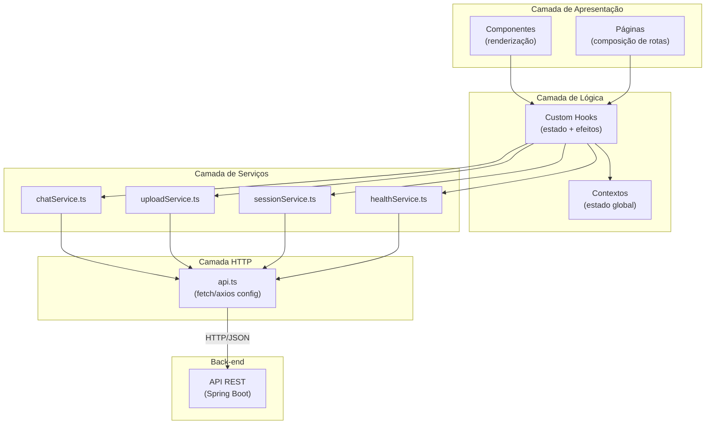
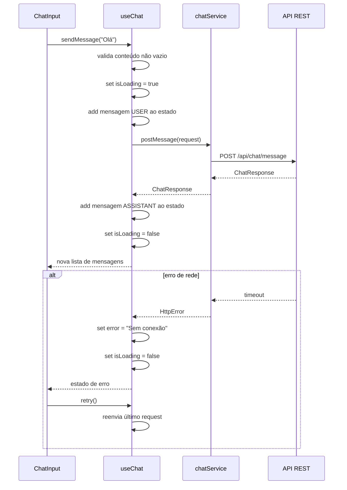
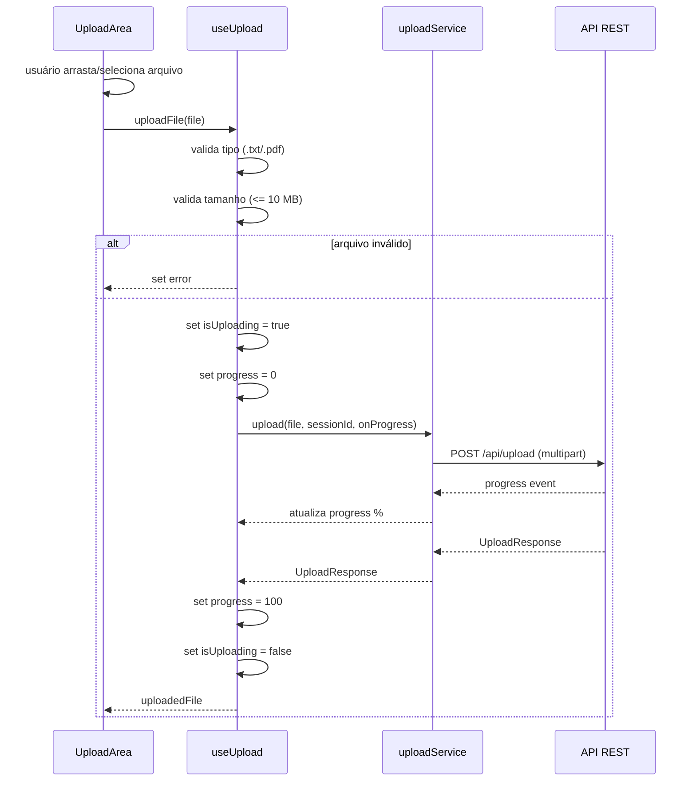
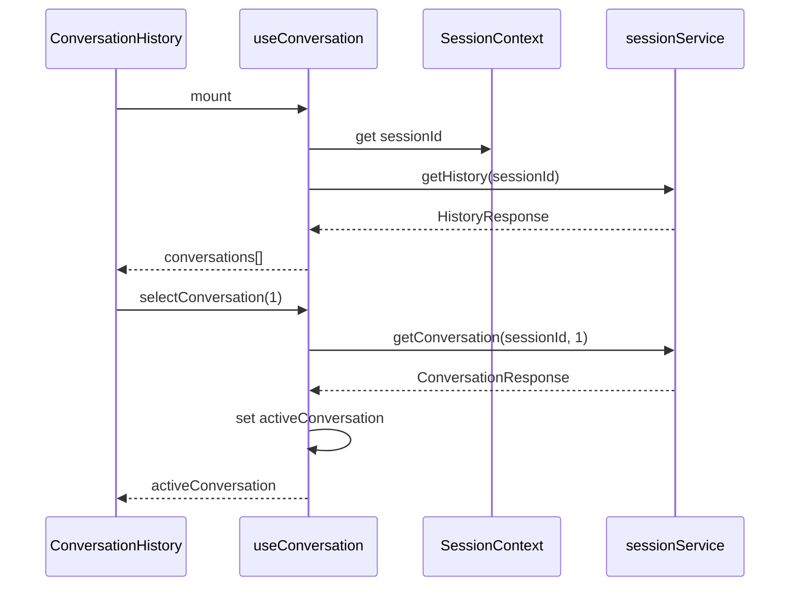
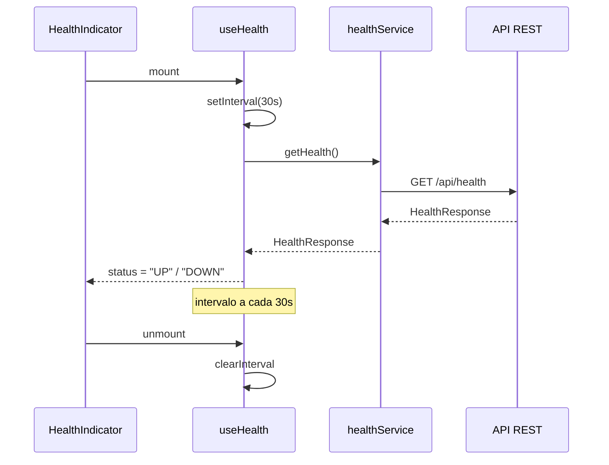
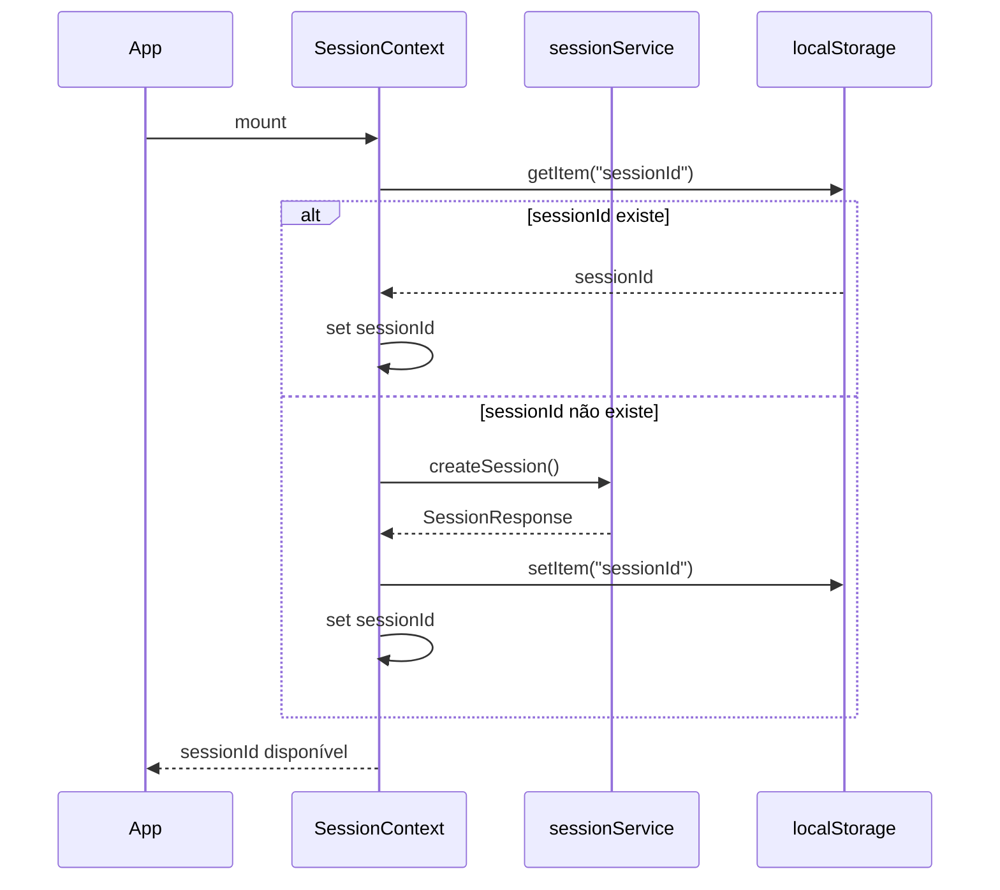

# System Docs — Front-end

> **Contrato oficial — Camada Front-end do Chat Inteligente**  
> Versão: 1.0.0  
> Stack: React 18, TypeScript 5, Vite 5, CSS Modules  
> Propósito: Documentação arquitetural do front-end para equipe de desenvolvimento e geração automática de código por IA.

---

## Sumário

1. [Visão Geral do Front-end](#1-visão-geral-do-front-end)
2. [Arquitetura Front-end](#2-arquitetura-front-end)
3. [Estrutura de Componentes](#3-estrutura-de-componentes)
4. [Hooks Customizados](#4-hooks-customizados)
5. [Serviços HTTP](#5-serviços-http)
6. [Contextos Globais](#6-contextos-globais)
7. [Comunicação Front x Back](#7-comunicação-front-x-back)
8. [UX e Acessibilidade](#8-ux-e-acessibilidade)
9. [Validações do Front-end](#9-validações-do-front-end)
10. [Tratamento de Erros](#10-tratamento-de-erros)
11. [Responsividade](#11-responsividade)
12. [Estrutura de Diretórios](#12-estrutura-de-diretórios)
13. [README](#13-readme)
14. [AGENTS.md](#14-agentsmd)
15. [Considerações Arquiteturais](#15-considerações-arquiteturais)

---

# 1. Visão Geral do Front-end

## 1.1 Objetivo

Interface web Single Page Application (SPA) para chat interativo com suporte a upload de documentos. O front-end consome a API REST do back-end e oferece experiência responsiva, acessível e com feedback visual imediato para todas as operações.

## 1.2 Tecnologias

| Componente | Tecnologia |
|------------|-----------|
| Framework | React 18 |
| Linguagem | TypeScript 5 |
| Bundler | Vite 5 |
| Estilização | CSS Modules |
| Testes | Vitest + Testing Library |
| HTTP | Fetch API / Axios |
| Estado Global | Context API |

## 1.3 Escopo

| Inclui | Não inclui |
|--------|-----------|
| Envio de mensagens com feedback visual | WebSocket / streaming de respostas |
| Upload via drag and drop + seletor | Autenticação OAuth |
| Histórico de conversas navegável | PWA / Service Workers |
| Indicador de saúde da API | Testes E2E (Cypress/Playwright) |
| Estados de loading, erro e vazio | SSR / Next.js |
| Responsividade mobile/tablet/desktop | Renderização no servidor |
| Acessibilidade ARIA + teclado | Animações complexas |

## 1.4 Arquitetura Geral do Front-end



---

# 2. Arquitetura Front-end

## 2.1 Separação de Camadas

```
┌──────────────────────────────────────────────────┐
│              Components (UI pura)                  │
│    Renderizam JSX, recebem props, sem lógica      │
├──────────────────────────────────────────────────┤
│                Custom Hooks                        │
│    Estado, efeitos colaterais, chamadas a API     │
├──────────────────────────────────────────────────┤
│                  Services                          │
│     Funções HTTP tipadas (request/response)       │
├──────────────────────────────────────────────────┤
│                  Contexts                          │
│      Estado global: sessão, conversa ativa        │
├──────────────────────────────────────────────────┤
│               Types  │  Utils  │  Assets           │
└──────────────────────────────────────────────────┘
```

## 2.2 Responsabilidade de Cada Camada

### Components
- Renderização pura de JSX.
- Recebem dados e callbacks via `props`.
- Podem usar hooks para estado local (`useState`, `useReducer`).
- **Não fazem chamadas HTTP diretamente.**
- **Não contêm lógica de negócio.**

```tsx
// Exemplo: MessageItem.tsx
interface MessageItemProps {
  role: 'USER' | 'ASSISTANT';
  content: string;
  timestamp: string;
  attachment?: AttachmentSummary;
}

export function MessageItem({ role, content, timestamp, attachment }: MessageItemProps) {
  return (
    <div className={`message message--${role.toLowerCase()}`} role="log" aria-live="polite">
      <div className="message__avatar">{role === 'USER' ? '👤' : '🤖'}</div>
      <div className="message__body">
        <p className="message__content">{content}</p>
        {attachment && <AttachmentBadge fileName={attachment.fileName} />}
        <time className="message__time">{formatTime(timestamp)}</time>
      </div>
    </div>
  );
}
```

### Custom Hooks
- Encapsulam estado, efeitos e chamadas a serviços.
- Gerenciam `loading`, `error`, `data`.
- Expõem métodos e estados para componentes.

### Services
- Funções puras que chamam a API REST.
- Tipagem estrita de entrada e saída.
- Tratamento de erro HTTP → exceção tipada.

### Contexts
- Estado global compartilhado sem prop drilling.
- `SessionContext`: sessionId, criar/encerrar sessão.
- `ConversationContext`: conversa ativa, mensagens, histórico.

### Pages
- Componentes de alto nível que compõem UI + hooks.
- Equivalentes a rotas (ex.: `ChatPage`, `NotFoundPage`).

### Types
- Definições TypeScript de DTOs, props, estados.

### Utils
- Validadores (`isValidSessionId`, `isAllowedFileType`, `isWithinFileSizeLimit`).
- Formatadores (`formatTime`, `formatFileSize`, `formatFileType`).
- Constantes (`API_BASE_URL`, `UPLOAD_MAX_SIZE`, `ALLOWED_TYPES`, `TIMEOUTS`).

---

# 3. Estrutura de Componentes

## 3.1 Árvore Completa

```
App
├── SessionProvider (Context)
│   └── Layout
│       ├── Header
│       │   ├── Logo
│       │   ├── HealthIndicator          ← useHealth()
│       │   └── NewChatButton
│       ├── Sidebar
│       │   ├── ConversationHistory      ← useConversation()
│       │   │   ├── ConversationItem
│       │   │   ├── ConversationItem
│       │   │   └── ...
│       │   └── EmptyHistory
│       ├── Main (ChatWindow)
│       │   ├── MessageList
│       │   │   ├── MessageItem (role: USER)
│       │   │   │   └── AttachmentBadge
│       │   │   ├── MessageItem (role: ASSISTANT)
│       │   │   └── ...
│       │   ├── EmptyState
│       │   ├── Loading
│       │   ├── ErrorMessage
│       │   └── ChatInput
│       │       ├── TextArea
│       │       ├── SendButton
│       │       └── UploadArea
│       │           ├── DragDropZone
│       │           ├── FileSelector
│       │           └── UploadProgress    ← useUpload()
│       └── Footer
```

## 3.2 Responsabilidade de Cada Componente

| Componente | Responsabilidade |
|------------|-----------------|
| `App` | Componente raiz. Define providers e renderiza rota. |
| `SessionProvider` | Provider do `SessionContext`. Inicializa sessão ao montar. |
| `Layout` | Estrutura de grid: Header fixo, Sidebar, ChatWindow, Footer. |
| `Header` | Logo, indicador de saúde, botão de nova conversa. |
| `Logo` | Logotipo / nome da aplicação. |
| `HealthIndicator` | Indicador verde/vermelho da saúde da API. Usa `useHealth()`. |
| `NewChatButton` | Botão que cria nova conversa via contexto. |
| `Sidebar` | Painel lateral com histórico de conversas. |
| `ConversationHistory` | Lista de conversas da sessão. Usa `useConversation()`. |
| `ConversationItem` | Item do histórico: título, data, contagem de mensagens. |
| `EmptyHistory` | Estado vazio: "Nenhuma conversa ainda." |
| `ChatWindow` | Área principal: MessageList + ChatInput. |
| `MessageList` | Lista rolável de mensagens com scroll automático. |
| `MessageItem` | Bolha de mensagem com estilo diferente para USER/ASSISTANT. |
| `AttachmentBadge` | Ícone e nome do arquivo anexado na mensagem. |
| `EmptyState` | Tela inicial: "Comece uma conversa..." |
| `Loading` | Spinner / skeleton loader. |
| `ErrorMessage` | Mensagem de erro com botão "Tentar novamente". |
| `ChatInput` | Área de texto + botão enviar + gatilho de upload. |
| `TextArea` | Textarea com auto-resize, Enter envia, Shift+Enter nova linha. |
| `SendButton` | Botão de envio. Desabilitado se vazio ou loading. Exibe spinner. |
| `UploadArea` | Área de upload: drag and drop + seletor de arquivos. |
| `DragDropZone` | Região que aceita arquivos arrastados com feedback visual. |
| `FileSelector` | Input file oculto acionado por clique. |
| `UploadProgress` | Barra de progresso com nome do arquivo e porcentagem. |
| `Footer` | Informações institucionais / versão. |

---

# 4. Hooks Customizados

## 4.1 `useChat()`

| Aspecto | Descrição |
|---------|-----------|
| **Arquivo** | `src/hooks/useChat.ts` |
| **Responsabilidade** | Gerenciar o envio de mensagens e a lista de mensagens da conversa ativa. |

### Estados

```typescript
interface UseChatReturn {
  messages: Message[];
  isLoading: boolean;
  error: string | null;
  sendMessage: (content: string) => Promise<void>;
  retry: () => Promise<void>;
  clearMessages: () => void;
}
```

### Fluxo



### Efeitos Colaterais
- Atualiza `ConversationContext` quando uma nova conversa é criada.
- Dispara scroll automático no `MessageList` via `useEffect`.

### Chamadas REST
- `POST /api/chat/message`

---

## 4.2 `useUpload()`

| Aspecto | Descrição |
|---------|-----------|
| **Arquivo** | `src/hooks/useUpload.ts` |
| **Responsabilidade** | Gerenciar upload de arquivos com barra de progresso. |

### Estados

```typescript
interface UseUploadReturn {
  progress: number;
  isUploading: boolean;
  uploadedFile: UploadResponse | null;
  error: string | null;
  uploadFile: (file: File) => Promise<void>;
  reset: () => void;
}
```

### Fluxo



### Efeitos Colaterais
- Armazena `attachmentId` no `ConversationContext` para associar à próxima mensagem.

### Chamadas REST
- `POST /api/upload` (`multipart/form-data` com `onUploadProgress`)

---

## 4.3 `useConversation()`

| Aspecto | Descrição |
|---------|-----------|
| **Arquivo** | `src/hooks/useConversation.ts` |
| **Responsabilidade** | Gerenciar histórico de conversas e a conversa ativa. |

### Estados

```typescript
interface UseConversationReturn {
  conversations: ConversationSummary[];
  activeConversation: Conversation | null;
  isLoading: boolean;
  error: string | null;
  fetchHistory: () => Promise<void>;
  selectConversation: (id: number) => Promise<void>;
  createNewConversation: () => void;
}
```

### Fluxo



### Efeitos Colaterais
- Busca histórico automaticamente ao montar o hook.
- Salva `sessionId` no `localStorage` via `SessionContext`.
- Atualiza `ConversationContext` com a conversa ativa.

### Chamadas REST
- `GET /api/chat/history/{sessionId}`
- `GET /api/chat/history/{sessionId}/{conversationId}`

---

## 4.4 `useHealth()`

| Aspecto | Descrição |
|---------|-----------|
| **Arquivo** | `src/hooks/useHealth.ts` |
| **Responsabilidade** | Monitorar periodicamente a saúde da API. |

### Estados

```typescript
interface UseHealthReturn {
  status: 'UP' | 'DOWN' | 'CHECKING';
  lastCheck: Date | null;
  checkHealth: () => Promise<void>;
}
```

### Fluxo



### Efeitos Colaterais
- `setInterval` a cada 30 segundos para verificação periódica.
- Cleanup do intervalo no `useEffect` unmount.
- Não impede o uso da aplicação se o health check falhar.

### Chamadas REST
- `GET /api/health`

---

# 5. Serviços HTTP

## 5.1 api.ts — Instância Compartilhada

```typescript
// Configuração global do HTTP client
const API_BASE_URL = import.meta.env.VITE_API_BASE_URL ?? 'http://localhost:8080';
const DEFAULT_TIMEOUT = 30_000;

const api = {
  baseURL: API_BASE_URL,
  timeout: DEFAULT_TIMEOUT,
  headers: { 'Content-Type': 'application/json' },
};
```

**Responsabilidades:**
- Definir `baseURL` a partir de variável de ambiente.
- Configurar timeout global.
- Incluir headers padrão (`Content-Type: application/json`).

## 5.2 chatService.ts

```typescript
// src/services/chatService.ts

export async function postMessage(request: ChatRequest): Promise<ChatResponse> {
  const response = await fetch(`${API_BASE_URL}/api/chat/message`, {
    method: 'POST',
    headers: { 'Content-Type': 'application/json' },
    body: JSON.stringify(request),
    signal: AbortSignal.timeout(30_000),
  });
  if (!response.ok) {
    throw new HttpError(response.status, await response.json());
  }
  return response.json();
}

export async function getHistory(sessionId: string): Promise<HistoryResponse> {
  const response = await fetch(`${API_BASE_URL}/api/chat/history/${sessionId}`, {
    signal: AbortSignal.timeout(15_000),
  });
  if (!response.ok) throw new HttpError(response.status, await response.json());
  return response.json();
}

export async function getConversation(sessionId: string, conversationId: number): Promise<ConversationResponse> {
  const response = await fetch(`${API_BASE_URL}/api/chat/history/${sessionId}/${conversationId}`, {
    signal: AbortSignal.timeout(15_000),
  });
  if (!response.ok) throw new HttpError(response.status, await response.json());
  return response.json();
}
```

## 5.3 uploadService.ts

```typescript
// src/services/uploadService.ts

export async function uploadFile(
  file: File,
  sessionId: string,
  onProgress?: (percent: number) => void
): Promise<UploadResponse> {
  const formData = new FormData();
  formData.append('file', file);
  formData.append('sessionId', sessionId);

  const xhr = new XMLHttpRequest();
  // Implementar progresso via xhr.upload.onprogress
  // ...

  return new Promise((resolve, reject) => {
    xhr.upload.onprogress = (e) => {
      if (e.lengthComputable && onProgress) {
        onProgress(Math.round((e.loaded / e.total) * 100));
      }
    };
    xhr.onload = () => {
      if (xhr.status >= 200 && xhr.status < 300) {
        resolve(JSON.parse(xhr.responseText));
      } else {
        reject(new HttpError(xhr.status, JSON.parse(xhr.responseText)));
      }
    };
    xhr.onerror = () => reject(new Error('Erro de rede'));
    xhr.ontimeout = () => reject(new Error('Tempo limite excedido'));
    xhr.timeout = 120_000;
    xhr.open('POST', `${API_BASE_URL}/api/upload`);
    xhr.send(formData);
  });
}
```

## 5.4 healthService.ts

```typescript
// src/services/healthService.ts

export async function getHealth(): Promise<HealthResponse> {
  const response = await fetch(`${API_BASE_URL}/api/health`, {
    signal: AbortSignal.timeout(5_000),
  });
  if (!response.ok) throw new HttpError(response.status, await response.json());
  return response.json();
}
```

## 5.5 sessionService.ts

```typescript
// src/services/sessionService.ts

export async function createSession(): Promise<SessionResponse> {
  const response = await fetch(`${API_BASE_URL}/api/session`, {
    signal: AbortSignal.timeout(10_000),
  });
  if (!response.ok) throw new HttpError(response.status, await response.json());
  return response.json();
}

export async function deleteSession(sessionId: string): Promise<void> {
  const response = await fetch(`${API_BASE_URL}/api/session/${sessionId}`, {
    method: 'DELETE',
  });
  if (!response.ok) throw new HttpError(response.status, await response.json());
}
```

---

# 6. Contextos Globais

## 6.1 SessionContext

| Aspecto | Descrição |
|---------|-----------|
| **Arquivo** | `src/contexts/SessionContext.tsx` |
| **Propósito** | Gerenciar o identificador único da sessão do usuário. |

### Estado

```typescript
interface SessionContextType {
  sessionId: string | null;
  isLoading: boolean;
  error: string | null;
  initialize: () => Promise<void>;
  destroy: () => Promise<void>;
}
```

### Fluxo



### Responsabilidades
- Inicializar sessão ao carregar a aplicação.
- Persistir `sessionId` no `localStorage`.
- Fornecer `sessionId` para toda a árvore de componentes.

---

## 6.2 ConversationContext

| Aspecto | Descrição |
|---------|-----------|
| **Arquivo** | `src/contexts/ConversationContext.tsx` |
| **Propósito** | Gerenciar a conversa ativa e seu estado. |

### Estado

```typescript
interface ConversationContextType {
  activeConversation: Conversation | null;
  messages: Message[];
  setActiveConversation: (conversation: Conversation | null) => void;
  addMessage: (message: Message) => void;
  clearMessages: () => void;
}
```

### Responsabilidades
- Armazenar a conversa atualmente selecionada.
- Manter a lista de mensagens da conversa ativa.
- Permitir que `useChat()` e `useConversation()` atualizem o estado compartilhado.

---

# 7. Comunicação Front x Back

## 7.1 Visão Geral

Toda comunicação ocorre via **HTTP/JSON** (com exceção do upload que usa `multipart/form-data`).

```
React SPA  ──HTTP/JSON──▶  API REST (Spring Boot)
           ◀──JSON────────
```

## 7.2 Request Flow

```
Component → Hook → Service → fetch() → API REST
                                      ↓
Component ← Hook ← Service ← JSON ←───
```

## 7.3 Tratamento de Erro

| Situação | HTTP Status | Ação no Front-end |
|----------|-------------|-------------------|
| Sucesso | 200–299 | Processar resposta |
| Validação | 400, 422 | Exibir mensagem de erro do campo |
| Não encontrado | 404 | Exibir "Recurso não encontrado" |
| Arquivo grande | 413 | Exibir "Arquivo excede 10 MB" |
| Tipo não suportado | 415 | Exibir "Formato não aceito" |
| Erro interno | 500 | Exibir "Erro no servidor. Tente novamente." |
| Timeout | — | Exibir "Tempo limite excedido" |
| Offline | — | Exibir "Sem conexão com o servidor" |

### Estrutura do Erro no Front-end

```typescript
class HttpError extends Error {
  constructor(
    public status: number,
    public body: ErrorResponse
  ) {
    super(body.message || 'Erro desconhecido');
  }
}
```

## 7.4 Loading States

| Operação | Indicador | Duração |
|----------|-----------|---------|
| Envio de mensagem | Spinner no SendButton + desabilitar input | Até resposta |
| Upload | Barra de progresso numérica | Até conclusão |
| Carregamento do histórico | Skeleton loader na Sidebar | Até resposta |
| Health check | Indicador "Verificando..." (amarelo) | 5s timeout |

## 7.5 Retry

### Estratégia
- **Automático:** 3 tentativas com backoff exponencial (1s, 2s, 4s) para erros `5xx` e de rede.
- **Manual:** Botão "Tentar novamente" no `ErrorMessage` para o usuário acionar retry.

```typescript
async function withRetry<T>(
  fn: () => Promise<T>,
  maxRetries = 3,
  baseDelay = 1000
): Promise<T> {
  for (let attempt = 0; attempt <= maxRetries; attempt++) {
    try {
      return await fn();
    } catch (error) {
      if (attempt === maxRetries || (error instanceof HttpError && error.status < 500)) {
        throw error;
      }
      await new Promise((r) => setTimeout(r, baseDelay * Math.pow(2, attempt)));
    }
  }
  throw new Error('Retry exhausted');
}
```

## 7.6 Timeouts

| Contexto | Timeout | Estratégia |
|----------|---------|------------|
| `POST /api/chat/message` | 30s | `AbortSignal.timeout` |
| `POST /api/upload` | 120s | `xhr.timeout` |
| `GET /api/chat/history` | 15s | `AbortSignal.timeout` |
| `GET /api/health` | 5s | `AbortSignal.timeout` |

---

# 8. UX e Acessibilidade

## 8.1 Drag and Drop

- A `UploadArea` deve aceitar arquivos arrastados de qualquer lugar.
- Feedback visual durante o drag: borda destacada, cor de fundo alterada.
- Ao soltar: validação automática do arquivo.
- Arquivos inválidos: feedback visual imediato com mensagem.

### Estados Visuais do DragDropZone

| Estado | Aparência |
|--------|-----------|
| Padrão | Borda tracejada, texto "Arraste arquivo ou clique para selecionar" |
| Drag Over | Borda sólida colorida, fundo com realce |
| Arquivo inválido | Borda vermelha, mensagem de erro |
| Upload em andamento | Borda azul, barra de progresso |

## 8.2 Barra de Progresso (UploadProgress)

- Exibe: nome do arquivo, porcentagem (ex.: "47%"), barra de preenchimento.
- Transição CSS: `width 0.3s ease`.
- Ao completar: barra verde + texto "Concluído".
- Em caso de erro: barra vermelha + texto do erro.

```html
<div role="progressbar" aria-valuenow="47" aria-valuemin="0" aria-valuemax="100">
  <span class="progress__label">relatorio.pdf</span>
  <div class="progress__bar" style="width: 47%"></div>
  <span class="progress__percent">47%</span>
</div>
```

## 8.3 Feedback Visual

| Ação | Feedback |
|------|----------|
| Nova mensagem enviada | Fade-in animado |
| Resposta chegando | Indicador de digitação ("...") |
| Upload concluído | Check verde + toast "Arquivo enviado" |
| Erro de validação | Borda vermelha no campo + mensagem inline |
| Erro de API | Toast no canto superior direito (5s) |
| Erro de rede | Banner no topo "Você está offline" |

## 8.4 Estados Vazios

| Contexto | Mensagem | Ação |
|----------|----------|------|
| Sidebar sem conversas | "Nenhuma conversa ainda." | Botão "Nova Conversa" |
| ChatWindow sem mensagens | "Comece uma conversa! Envie uma mensagem ou um arquivo." | — |
| Upload sem arquivos | "Arraste um arquivo .txt ou .pdf aqui" | Botão "Selecionar Arquivo" |

## 8.5 Responsividade

| Dispositivo | Largura | Layout |
|-------------|---------|--------|
| Mobile | < 768px | Sidebar oculta (hambúrguer). Chat 100%. |
| Tablet | 768–1024px | Sidebar colapsável. Chat com margem. |
| Desktop | > 1024px | Sidebar fixa (300px). Chat flexível. |

### Pontos de Quebra (CSS)

```css
/* Mobile first */
.sidebar {
  display: none;
}

@media (min-width: 768px) {
  .sidebar {
    display: block;
    width: 280px;
  }
}

@media (min-width: 1024px) {
  .sidebar {
    width: 300px;
  }
  .chat-window {
    max-width: 800px;
  }
}
```

## 8.6 Navegação por Teclado

| Tecla | Elemento | Ação |
|-------|----------|------|
| `Enter` | TextArea | Enviar mensagem |
| `Shift + Enter` | TextArea | Nova linha |
| `Escape` | Toast / Modal | Fechar |
| `Tab` | Todos | Navegação sequencial |
| `Ctrl + K` | Global | Focar input de nova conversa |

## 8.7 ARIA (Accessible Rich Internet Applications)

| Elemento | Atributo ARIA | Propósito |
|----------|---------------|-----------|
| `MessageList` | `role="log"`, `aria-live="polite"` | Região de atualização ao vivo |
| `SendButton` | `aria-label="Enviar mensagem"` | Descrever ação |
| `TextArea` | `aria-describedby="error-msg"` | Vincular erro |
| `UploadProgress` | `role="progressbar"`, `aria-valuenow` | Barra de progresso acessível |
| `DragDropZone` | `role="button"`, `tabindex="0"` | Interação por teclado |
| `Header` | `<header>` | Landmark |
| `Sidebar` | `<nav aria-label="Histórico">` | Landmark de navegação |
| `ErrorMessage` | `role="alert"` | Notificação de erro |

## 8.8 Contraste (WCAG 2.1 AA)

| Requisito | Ratio | Aplicação |
|-----------|-------|-----------|
| Texto normal | ≥ 4.5:1 | Corpo de mensagens, labels |
| Texto grande (≥ 18px) | ≥ 3:1 | Títulos, botões |
| Componentes UI | ≥ 3:1 | Bordas, ícones |
| Foco visível | `outline: 2px solid` | Todos os elementos interativos |

### Modo Escuro

Suporte via `prefers-color-scheme`:

```css
:root {
  --color-bg: #ffffff;
  --color-text: #1a1a1a;
  --color-message-user: #e3f2fd;
  --color-message-assistant: #f5f5f5;
}

@media (prefers-color-scheme: dark) {
  :root {
    --color-bg: #1a1a1a;
    --color-text: #e0e0e0;
    --color-message-user: #1e3a5f;
    --color-message-assistant: #2d2d2d;
  }
}
```

---

# 9. Validações do Front-end

## 9.1 Validações no Front-end

Todas as validações são feitas **antes** da chamada HTTP para evitar requisições desnecessárias.

| Regra | Hook/Service | Ação |
|-------|-------------|------|
| Mensagem vazia | `useChat` | Desabilitar `SendButton`. Exibir "Digite uma mensagem." |
| Mensagem > 5000 caracteres | `useChat` | Bloquear envio. Exibir "Máximo de 5000 caracteres." |
| Arquivo não selecionado | `useUpload` | Desabilitar upload. Exibir "Selecione um arquivo." |
| Arquivo > 10 MB | `useUpload` | Bloquear upload. Exibir "Arquivo excede 10 MB." |
| Tipo diferente de `.txt` / `.pdf` | `useUpload` | Bloquear upload. Exibir "Apenas .txt e .pdf são aceitos." |
| `sessionId` inválido | `SessionContext` | Recriar sessão. Exibir "Sessão inválida, reconectando..." |

## 9.2 Utilitários de Validação

```typescript
// src/utils/validators.ts

const ALLOWED_TYPES = ['text/plain', 'application/pdf'] as const;
const MAX_FILE_SIZE = 10 * 1024 * 1024; // 10 MB
const MAX_MESSAGE_LENGTH = 5000;

export function isValidMessage(content: string): boolean {
  return content.trim().length > 0 && content.length <= MAX_MESSAGE_LENGTH;
}

export function isAllowedFileType(mimeType: string): boolean {
  return ALLOWED_TYPES.includes(mimeType as typeof ALLOWED_TYPES[number]);
}

export function isWithinFileSizeLimit(size: number): boolean {
  return size <= MAX_FILE_SIZE;
}

export function isValidSessionId(id: string): boolean {
  return /^[0-9a-f]{8}-[0-9a-f]{4}-[0-9a-f]{4}-[0-9a-f]{4}-[0-9a-f]{12}$/i.test(id);
}

export function getFileExtension(fileName: string): string {
  return fileName.split('.').pop()?.toLowerCase() ?? '';
}
```

## 9.3 Feedback de Validação

```typescript
// Hook: useChat
function validateMessage(content: string): string | null {
  if (!content.trim()) return 'A mensagem não pode estar vazia.';
  if (content.length > 5000) return 'A mensagem excede o limite de 5000 caracteres.';
  return null;
}
```

```typescript
// Hook: useUpload
function validateFile(file: File): string | null {
  if (!file) return 'Nenhum arquivo selecionado.';
  if (!isAllowedFileType(file.type) && !isAllowedExtension(file.name)) {
    return 'Apenas arquivos .txt e .pdf são aceitos.';
  }
  if (!isWithinFileSizeLimit(file.size)) {
    return 'O arquivo excede o limite de 10 MB.';
  }
  return null;
}
```

---

# 10. Tratamento de Erros

## 10.1 Estratégia

```
HTTP Error / Network Error
        │
        ▼
  Serviço lança HttpError
        │
        ▼
  Hook captura o erro
        │
        ├── set error message
        ├── set isLoading = false
        └── retry() disponível
        │
        ▼
  Componente renderiza ErrorMessage
        │
        └── Botão "Tentar novamente" → retry()
```

## 10.2 Hierarquia de Erros no Front-end

```typescript
interface ErrorResponse {
  status: number;
  error: string;
  message: string;
  timestamp: string;
  path: string;
  errors?: { field: string; message: string }[];
}

class AppError extends Error {
  constructor(message: string, public code: string) {
    super(message);
  }
}

class HttpError extends AppError {
  constructor(
    public status: number,
    public body: ErrorResponse
  ) {
    super(getErrorMessage(status, body), `HTTP_${status}`);
  }
}

class NetworkError extends AppError {
  constructor() {
    super('Sem conexão com o servidor.', 'NETWORK_ERROR');
  }
}

class ValidationError extends AppError {
  constructor(message: string) {
    super(message, 'VALIDATION_ERROR');
  }
}
```

## 10.3 Mapeamento HTTP → Mensagem

```typescript
function getErrorMessage(status: number, body?: ErrorResponse): string {
  if (body?.errors?.length) {
    return body.errors[0].message;
  }
  if (body?.message) {
    return body.message;
  }
  const messages: Record<number, string> = {
    400: 'Verifique os dados enviados.',
    404: 'Recurso não encontrado.',
    413: 'O arquivo excede o limite de 10 MB.',
    415: 'Formato de arquivo não suportado.',
    422: 'Os dados enviados são inválidos.',
    500: 'Erro no servidor. Tente novamente mais tarde.',
  };
  return messages[status] ?? 'Ocorreu um erro inesperado.';
}
```

---

# 11. Responsividade

## 11.1 Layout Grid

```css
/* Layout principal */
.app-layout {
  display: grid;
  grid-template-areas:
    "header  header"
    "sidebar main"
    "footer  footer";
  grid-template-columns: 300px 1fr;
  grid-template-rows: auto 1fr auto;
  min-height: 100vh;
}

@media (max-width: 767px) {
  .app-layout {
    grid-template-areas:
      "header"
      "main"
      "footer";
    grid-template-columns: 1fr;
  }
}
```

## 11.2 Sidebar Responsiva

| Estado | Comportamento |
|--------|---------------|
| Mobile | Oculta. Botão hambúrguer no Header abre como overlay. |
| Tablet | Colapsável. Ícones sem texto quando colapsada. |
| Desktop | Sempre visível (300px). |

## 11.3 ChatWindow Responsiva

| Dispositivo | Largura do Chat | Comportamento |
|-------------|-----------------|---------------|
| Mobile | 100% | Input ocupa toda a largura |
| Tablet | 100% (com sidebar colapsada) | Input com margens laterais |
| Desktop | `max-width: 800px` + margens | Centralizado no espaço restante |

---

# 12. Estrutura de Diretórios

```
chat-frontend/
├── package.json
├── tsconfig.json
├── vite.config.ts
├── index.html
├── public/
│   └── favicon.svg
├── src/
│   ├── main.tsx                          # Entry point
│   ├── App.tsx                           # Componente raiz
│   ├── components/
│   │   ├── Layout/
│   │   │   ├── Layout.tsx
│   │   │   ├── Layout.module.css
│   │   │   ├── Header.tsx
│   │   │   ├── Header.module.css
│   │   │   ├── Sidebar.tsx
│   │   │   ├── Sidebar.module.css
│   │   │   └── Footer.tsx
│   │   ├── Chat/
│   │   │   ├── ChatWindow.tsx
│   │   │   ├── ChatWindow.module.css
│   │   │   ├── MessageList.tsx
│   │   │   ├── MessageList.module.css
│   │   │   ├── MessageItem.tsx
│   │   │   ├── MessageItem.module.css
│   │   │   ├── ChatInput.tsx
│   │   │   ├── ChatInput.module.css
│   │   │   └── AttachmentBadge.tsx
│   │   ├── Upload/
│   │   │   ├── UploadArea.tsx
│   │   │   ├── UploadArea.module.css
│   │   │   ├── DragDropZone.tsx
│   │   │   ├── DragDropZone.module.css
│   │   │   ├── UploadProgress.tsx
│   │   │   ├── UploadProgress.module.css
│   │   │   └── FileSelector.tsx
│   │   ├── History/
│   │   │   ├── ConversationHistory.tsx
│   │   │   ├── ConversationHistory.module.css
│   │   │   ├── ConversationItem.tsx
│   │   │   └── ConversationItem.module.css
│   │   └── Common/
│   │       ├── Loading.tsx
│   │       ├── Loading.module.css
│   │       ├── EmptyState.tsx
│   │       ├── EmptyState.module.css
│   │       ├── ErrorMessage.tsx
│   │       ├── ErrorMessage.module.css
│   │       ├── HealthIndicator.tsx
│   │       ├── HealthIndicator.module.css
│   │       ├── Toast.tsx
│   │       └── Toast.module.css
│   ├── hooks/
│   │   ├── useChat.ts
│   │   ├── useChat.test.ts
│   │   ├── useUpload.ts
│   │   ├── useUpload.test.ts
│   │   ├── useConversation.ts
│   │   ├── useConversation.test.ts
│   │   ├── useHealth.ts
│   │   └── useHealth.test.ts
│   ├── pages/
│   │   ├── ChatPage.tsx
│   │   ├── ChatPage.module.css
│   │   ├── NotFoundPage.tsx
│   │   └── NotFoundPage.module.css
│   ├── services/
│   │   ├── api.ts
│   │   ├── chatService.ts
│   │   ├── uploadService.ts
│   │   ├── sessionService.ts
│   │   └── healthService.ts
│   ├── contexts/
│   │   ├── SessionContext.tsx
│   │   └── ConversationContext.tsx
│   ├── types/
│   │   ├── message.ts
│   │   ├── conversation.ts
│   │   ├── session.ts
│   │   ├── upload.ts
│   │   └── health.ts
│   ├── utils/
│   │   ├── validators.ts
│   │   ├── validators.test.ts
│   │   ├── formatters.ts
│   │   ├── formatters.test.ts
│   │   └── constants.ts
│   └── assets/
│       └── styles/
│           ├── global.css
│           └── variables.css
```

---

# 13. README

```markdown
# Chat Frontend

Interface web do sistema de chat com suporte a upload de documentos.

## Tecnologias

- React 18
- TypeScript 5
- Vite 5
- CSS Modules
- Vitest + Testing Library

## Pré-requisitos

- Node.js 18+
- npm 9+ ou yarn 1.22+

## Instalação

```bash
git clone <repo-url>
cd chat-frontend
npm install
```

## Desenvolvimento

```bash
npm run dev
```

A aplicação estará disponível em `http://localhost:5173`.

## Build

```bash
npm run build
```

Os arquivos de produção serão gerados em `dist/`.

## Testes

```bash
npm test              # Testes unitários
npm run test:coverage # Com cobertura
npm run test:watch    # Modo watch
```

## Preview da Build

```bash
npm run preview
```

## Variáveis de Ambiente

| Variável | Padrão | Descrição |
|----------|--------|-----------|
| `VITE_API_BASE_URL` | `http://localhost:8080` | URL base da API REST |
| `VITE_UPLOAD_TIMEOUT` | `120000` | Timeout de upload (ms) |
| `VITE_HEALTH_INTERVAL` | `30000` | Intervalo de health check (ms) |

## Estrutura do Projeto

```
src/
├── components/    # Componentes visuais (UI pura)
├── hooks/         # Lógica reutilizável com estado
├── pages/         # Páginas/rotas
├── services/      # Chamadas HTTP para API REST
├── contexts/      # Estado global (sessão, conversa)
├── types/         # Definições TypeScript
├── utils/         # Validadores, formatadores, constantes
└── assets/        # Estilos globais
```

## Contrato

Esta aplicação consome a API REST documentada em `SYSTEM_DOCS.md` (seção 5) e `SYSTEM_DOCS_BACKEND.md` (seção 4).

## Scripts Disponíveis

| Comando | Descrição |
|---------|-----------|
| `npm run dev` | Iniciar servidor de desenvolvimento |
| `npm run build` | Build de produção |
| `npm run preview` | Preview da build |
| `npm test` | Executar testes |
| `npm run test:coverage` | Testes com relatório de cobertura |
| `npm run lint` | Verificar código com ESLint |
| `npm run typecheck` | Verificar tipos TypeScript |
```

---

# 14. AGENTS.md

```markdown
# AGENTS.md — Contexto para Geração do Front-end

## Objetivo

Gerar a interface SPA em React 18 + TypeScript 5 para sistema de chat com upload de documentos.

## Escopo

- Componentes visuais puros (sem lógica de negócio)
- Custom Hooks para estado, efeitos e chamadas HTTP
- Serviços HTTP tipados para cada endpoint
- Contextos globais (sessão e conversa ativa)
- Validação no front-end antes do envio
- Upload com barra de progresso via XMLHttpRequest
- Acessibilidade ARIA + navegação por teclado
- Responsividade mobile/tablet/desktop
- Estados: loading, erro, vazio, sucesso

## Tecnologias

- React 18, TypeScript 5, Vite 5
- CSS Modules (não usar bibliotecas de componentes)
- Vitest + Testing Library (testes)
- Fetch API para GET, fetch para POST, XMLHttpRequest para upload com progresso
- Context API (sem Redux ou bibliotecas externas de estado)

## Regras de Implementação

1. **Componentes** são puramente visuais — recebem dados por `props`, nunca chamam API diretamente.
2. **Hooks** encapsulam todo estado e efeitos colaterais — nunca renderizam JSX.
3. **Services** são funções puras que retornam `Promise<T>` — sem estado.
4. **Contexts** usam `createContext` + `useContext` — estado global mínimo.
5. **Tipagem estrita** — sem `any`. Todos os DTOs tipados em `src/types/`.
6. **CSS Modules** — um arquivo `.module.css` por componente.
7. **Testes** para hooks (`renderHook`) e utils — um arquivo `.test.ts` ao lado.
8. **Nomes** em inglês para código, português para mensagens ao usuário.
9. **Mensagens de erro** claras e acionáveis em português.
10. **ARIA** em todos os componentes interativos.

## Estrutura de Componentes (Árvore)

```
App → SessionProvider → Layout → Header (HealthIndicator, NewChatButton)
                                 → Sidebar (ConversationHistory → ConversationItem, EmptyHistory)
                                 → ChatWindow (MessageList → MessageItem → AttachmentBadge,
                                               EmptyState, Loading, ErrorMessage,
                                               ChatInput → TextArea, SendButton,
                                                          UploadArea → DragDropZone,
                                                                      FileSelector,
                                                                      UploadProgress)
                                 → Footer
```

## Hooks e suas Chamadas REST

| Hook | Método | Endpoint |
|------|--------|----------|
| `useChat` | `sendMessage()` | `POST /api/chat/message` |
| `useConversation` | `fetchHistory()` | `GET /api/chat/history/{sessionId}` |
| `useConversation` | `selectConversation()` | `GET /api/chat/history/{sessionId}/{conversationId}` |
| `useUpload` | `uploadFile()` | `POST /api/upload` (multipart) |
| `useHealth` | `checkHealth()` | `GET /api/health` |

## Tipos Principais

```typescript
// src/types/message.ts
interface Message {
  id: number;
  conversationId: number;
  role: 'USER' | 'ASSISTANT';
  content: string;
  timestamp: string;
  attachment?: AttachmentSummary | null;
}

// src/types/conversation.ts
interface ConversationSummary {
  id: number;
  title: string;
  messageCount: number;
  lastMessage: string;
  lastActivity: string;
}

// src/types/upload.ts
interface UploadResponse {
  attachmentId: number;
  fileName: string;
  fileType: string;
  fileSize: number;
  uploadedAt: string;
}

// src/types/health.ts
type HealthStatus = 'UP' | 'DOWN' | 'CHECKING';
```

## Validações (Front-end)

- Mensagem vazia → bloquear envio
- Mensagem > 5000 caracteres → bloquear envio
- Arquivo sem extensão `.txt` ou `.pdf` → bloquear upload
- Arquivo > 10 MB → bloquear upload
- `sessionId` inválido → recriar sessão
```

---

# 15. Considerações Arquiteturais

## 15.1 Separação entre Componentes e Hooks

**Decisão:** Componentes são puramente visuais; toda lógica está em Hooks.

**Justificativa:**
- **Testabilidade:** Hooks são testados com `renderHook` sem renderizar UI. Componentes são testados com snapshots sem lógica.
- **Reutilização:** `useChat()` pode ser usado em `ChatPage` e futuramente em um modal de "Feedback" sem duplicação.
- **Manutenibilidade:** Mudanças na lógica de envio de mensagem não afetam a estrutura visual do `MessageItem`.
- **Separação de responsabilidades:** Um `MessageItem` não precisa saber como os dados chegaram — apenas renderiza.

## 15.2 Serviços HTTP Desacoplados

**Decisão:** Toda comunicação HTTP está em `src/services/`, separada dos Hooks.

**Justificativa:**
- **Testabilidade:** Services são funções puras que retornam `Promise` — testáveis com mocks de `fetch`.
- **Substituição de HTTP client:** Trocar de `fetch` para `axios` exige alteração apenas em `api.ts` e nos services, não nos hooks.
- **Contrato explícito:** Cada service documenta exatamente qual endpoint chama e qual DTO espera.

## 15.3 Context API para Estado Global

**Decisão:** Usar Context API em vez de Redux, Zustand ou bibliotecas externas.

**Justificativa:**
- **Simplicidade:** O estado global é pequeno (sessionId + activeConversation). Context API é suficiente.
- **Zero dependências externas:** Reduz bundle size e complexidade.
- **Manutenibilidade:** `SessionContext` e `ConversationContext` são independentes e coesos.

## 15.4 CSS Modules em vez de Tailwind ou Styled Components

**Decisão:** CSS Modules para estilização.

**Justificativa:**
- **Isolamento:** Estilos são escopados ao componente — sem conflitos de classe.
- **Zero runtime:** CSS é processado em build, sem overhead de JavaScript.
- **Familiaridade:** Equipe de desenvolvimento conhece CSS padrão, sem curvas de aprendizado de bibliotecas.

## 15.5 Validação Duplicada (Front-end + Back-end)

**Decisão:** Validar no front-end antes de enviar e no back-end ao receber.

**Justificativa:**
- **UX:** Feedback imediato sem viagem de ida e volta ao servidor.
- **Segurança:** O back-end nunca confia no front-end — validações são refeitas no servidor.
- **Consistência:** As mesmas regras são aplicadas em ambas as camadas.

## 15.6 Preparação para IA

**Decisão:** A interface do chat é projetada para exibir respostas independentemente da origem (simulada ou IA).

**Justificativa:**
- `MessageItem` renderiza qualquer `Message`, independente de como o `content` foi gerado.
- `useChat()` chama `chatService.postMessage()` — o service pode mudar de endpoint sem alterar o hook.
- O campo `role` (`USER` / `ASSISTANT`) já contempla estrutura futura sem modificações no componente.

---

> **Documento gerado em: 25 de junho de 2026**  
> **Versão: 1.0.0**  
> **Status: aprovado**
